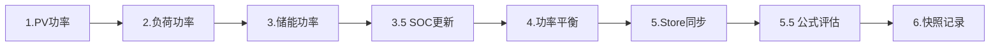
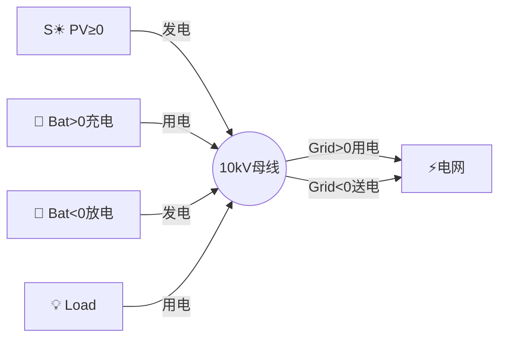
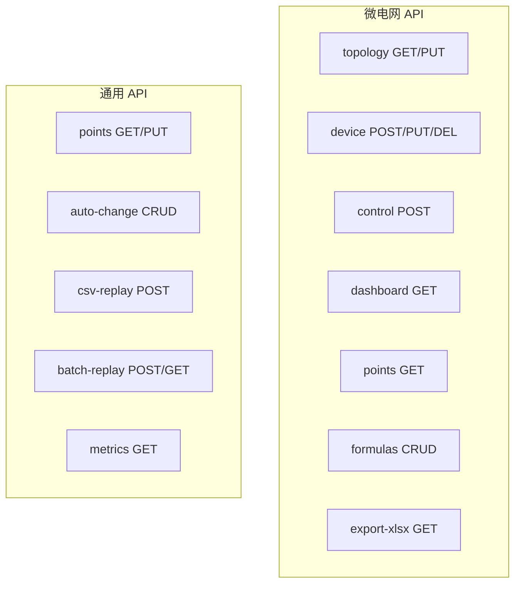

# GridSim 微电网 — 架构图

## 系统架构

```mermaid
graph TB
    subgraph Frontend["🖥 Vue3 前端"]
        ME[MicrogridEditor<br/>设备管理+SVG拓扑]
        DP[DetailPage<br/>测点/置数/策略]
        TP[TrendPage<br/>ECharts趋势]
        CP[ConfigPage<br/>实例管理]
    end

    subgraph API["🔌 REST API"]
        T[/microgrid/topology]
        D[/microgrid/dashboard]
        P[/microgrid/points]
        E[/instances/export-xlsx]
        CR[/instances/csv-replay]
        BR[/instances/batch-replay]
        MT[/instances/metrics]
    end

    subgraph Engine["⚙ Go 引擎"]
        MGE[微电网Engine<br/>tick/功率平衡/SOC/IOA]
        DE[Detail Engine<br/>auto-change/策略]
        FE[公式Engine<br/>{name}引用+表达式]
    end

    subgraph Store["💾 数据层"]
        S[(Store<br/>mapIOA→Point)]
        TJ[(TopologyJSON)]
        AC[(AutoChangeStore)]
    end

    ME --> T
    ME --> D
    DP --> P
    DP --> CR
    CP --> BR
    CP --> MT

    T --> MGE
    D --> MGE
    P --> MGE
    CR --> DE
    BR --> DE
    MT --> DE

    MGE --> S
    DE --> S
    FE --> S
    MGE --> TJ
    DE --> AC
```

## 引擎 Tick 流程



## 功率约定



## API 全景


