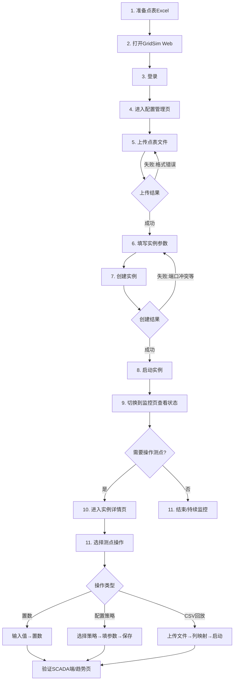
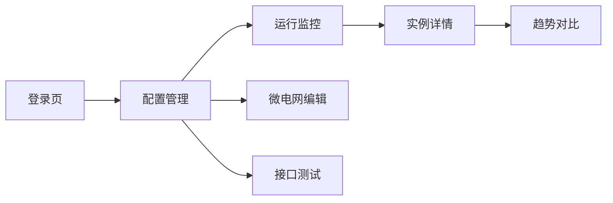

# GridSim UX分析与设计优化方案

> 版本: 1.0 | 日期: 2026-06-17 | 作者: Sisyphus

---

## 目录

1. [项目概述](#1-项目概述)
2. [用户画像与使用场景](#2-用户画像与使用场景)
3. [当前操作流程分析](#3-当前操作流程分析)
4. [用户痛点与优化机会](#4-用户痛点与优化机会)
5. [整体设计原则](#5-整体设计原则)
6. [前端设计方案](#6-前端设计方案)
7. [后端设计方案](#7-后端设计方案)
8. [实施路径](#8-实施路径)

---

## 1. 项目概述

### 1.1 GridSim 是什么

GridSim 是一个**多协议电网仿真平台**，支持 IEC 60870-5-104 和 Modbus TCP 协议，用于变电站自动化测试。它模拟 RTU 及间隔层设备，适用于 SCADA 系统开发和集成测试。

### 1.2 技术架构

```
Vue 3 + TypeScript + Element Plus + ECharts（前端）
        ↕ REST API / SSE / MCP
Go 1.21+ 引擎层（IEC104 / Modbus / 微电网 / 接口代理）
        ↕
数据层（Excel点表 / JSON持久化 / CSV回放文件）
```

### 1.3 现有页面

| 页面 | 路由 | 功能 | 复杂度 |
|------|------|------|--------|
| 登录页 | `/login` | JWT认证 | ⭐ |
| 配置管理 | `/config` | 实例CRUD、上传点表、启停 | ⭐⭐⭐⭐ |
| 运行监控 | `/monitor` | 全局实例状态看板 | ⭐⭐⭐ |
| 实例详情 | `/detail/:id` | 测点实时刷新、置数、策略配置、CSV回放 | ⭐⭐⭐⭐⭐ |
| 趋势对比 | `/trend` | ECharts多线趋势图 | ⭐⭐⭐ |
| 接口测试 | `/proxy` | Postman风格HTTP测试 | ⭐⭐⭐⭐ |
| 微电网编辑 | `/microgrid/:id` | 拓扑编辑、SVG渲染、功率仿真 | ⭐⭐⭐⭐⭐ |

---

## 2. 用户画像与使用场景

### 2.1 用户画像

| 画像 | 角色 | 技术背景 | 使用频率 | 核心需求 |
|------|------|----------|----------|----------|
| **张工** - SCADA测试工程师 | 主要用户 | 电力系统专家，熟悉IEC104但不一定熟悉编程 | 每日使用 | 快速创建仿真场景、模拟异常数据、验证SCADA响应 |
| **李工** - 自动化测试工程师 | 高频用户 | 会写脚本，使用API/MCP进行自动化测试 | 每日使用 | 批量操作、自动化测试、CI集成 |
| **王工** - 系统集成工程师 | 中期用户 | 熟悉网络配置，非电力专业 | 项目阶段使用 | 联调测试、协议对接验证 |
| **AI Agent** - 智能助手 | 新兴用户 | 通过MCP协议交互 | 持续 | API一致性、错误信息清晰、幂等性 |

### 2.2 使用场景

#### 场景A：SCADA系统联调测试（核心场景）
```
背景：张工需要模拟一个220kV变电站的遥测数据，测试新部署的SCADA系统。

用户步骤：
1. 准备点表Excel（定义测点名称、IOA、类型、系数）
2. 打开GridSim Web界面
3. 上传点表文件
4. 创建实例（配置名称、端口、协议）
5. 启动实例
6. 在SCADA侧验证连接和数据
7. 在GridSim中置数，验证SCADA端变化上送
8. 配置自动变化策略，模拟持续数据流
9. 观察趋势图，验证数据连续性

痛点：步骤3-4需要多次切换页面；点表格式错误要到提交后才提示
```

#### 场景B：异常工况模拟
```
背景：张工需要模拟电压越限、通信中断等异常场景。

用户步骤：
1. 在运行中的实例中找到测点
2. 手动置入异常值（如450V的高压值）
3. 修改品质描述QDS（设为"无效"或"溢出"）
4. 观察SCADA侧告警是否正确触发
5. 恢复正常值，验证恢复逻辑

痛点：品质描述修改入口深；批量修改需要逐点操作
```

#### 场景C：自动化回归测试
```
背景：李工需要对SCADA系统做回归测试，需重复执行50+测试用例。

用户步骤：
1. 准备CSV回放文件（包含时序数据）
2. 创建实例并上传CSV
3. 配置CSV多测点映射
4. 启动CSV回放
5. 执行测试用例
6. 导出测试结果

痛点：CSV列映射配置不够直观；批量回放的进度反馈不足
```

#### 场景D：微电网仿真
```
背景：王工需要搭建一个含光伏+储能+负荷的微电网模型进行仿真。

用户步骤：
1. 创建实例（选择微电网模式）
2. 进入微电网编辑器
3. 依次添加光伏、储能、负荷设备
4. 配置设备参数（容量、功率等）
5. 连接拓扑（母线）
6. 启动仿真
7. 控制开关、观察功率平衡
8. 导出点表供SCADA连接

痛点：首次使用学习成本高；参数配置与拓扑编辑分离；仿真结果反馈不够直观
```

#### 场景E：多实例批量管理
```
背景：大型测试项目涉及20+实例（多个变电站）。

用户步骤：
1. 批量上传多个点表
2. 批量创建实例
3. 逐个启动
4. 监控所有实例状态
5. 发现问题后进入详情排查

痛点：缺少批量操作（批量创建、批量启停）；监控页面信息密度与可读性需要平衡
```

---

## 3. 当前操作流程分析

### 3.1 核心流程（As-Is）



### 3.2 页面间导航流



---

## 4. 用户痛点与优化机会

### 4.1 痛点矩阵

| # | 痛点 | 频次 | 严重度 | 用户 | 优化机会 |
|---|------|------|--------|------|----------|
| P1 | 新手首次使用不知道从哪开始 | 低(首次) | 🔴高 | 所有用户 | 添加入门引导向导 |
| P2 | 点表格式错误提交后才报错 | 中 | 🔴高 | 张工/王工 | 上传前本地预览+校验 |
| P3 | 创建实例表单参数分散 | 高 | 🟡中 | 所有用户 | 简化表单+智能默认值 |
| P4 | 监控信息密度与可读性矛盾 | 持续 | 🟡中 | 所有用户 | 可配置看板/卡片布局 |
| P5 | 策略配置参数多且易混淆 | 中 | 🔴高 | 张工 | 可视化策略配置器 |
| P6 | CSV列映射配置不直观 | 低 | 🟡中 | 李工 | 拖拽式列映射 |
| P7 | 品质描述修改入口深 | 低 | 🔴高 | 张工 | 测点行内快速操作 |
| P8 | 缺少批量操作 | 高 | 🔴高 | 李工 | 批量选择+批量操作栏 |
| P9 | 错误信息不够友好 | 中 | 🟡中 | 所有用户 | 结构化错误+修复建议 |
| P10 | 微电网参数配置与拓扑分离 | 中 | 🟡中 | 王工 | 一体化拓扑-属性面板 |
| P11 | 趋势图测点选择繁琐 | 中 | 🟡中 | 张工 | 快捷测点选择+保存模板 |
| P12 | 界面切换闪烁/加载感 | 持续 | 🟡中 | 所有用户 | 骨架屏/过渡动画 |

### 4.2 优化优先级矩阵

```
高影响 ▲
       │
       │  P1  P5  P8         P4(P11)
       │  P7  P3  P9
       │
       │         P2  P6       P10 P12
       │
       └──────────────────────────────► 高可行
              低投入                    高投入
```

---

## 5. 整体设计原则

### 5.1 设计语言

- **风格**: 工业科技风 — 暗色主题，强调色 `#F97316` (橙色)/ `#3B82F6` (蓝色)，克制动效
- **色调**: 深色背景 `#0F172A`，卡片 `#1E293B`，边框 `#334155`
- **字体**: `JetBrains Mono` (代码/数据) + `Inter` (UI)
- **图标**: 统一使用SVG图标系统
- **布局**: 固定侧边栏 + 自适应主区域 + 上下文工具栏
- **反馈**: 微交互动效 (悬停/点击/状态变化)

### 5.2 可用性目标

1. **新手可在5分钟内完成首次仿真创建**
2. **所有操作3次点击可达**
3. **批量操作覆盖80%以上的重复场景**
4. **错误提示包含修复建议，平均修复时间<30秒**

### 5.3 交互准则

- 渐进式复杂性：默认简洁，高级功能按需展开
- 操作可逆：所有配置在提交前可预览和撤销
- 状态可见：操作后立即反馈，后台任务显示进度
- 一致性：同类操作保持相同的交互模式

---

## 6. 前端设计方案

### 6.1 页面架构重构

```
GridSim v4.0 新页面架构
├── 🏠 首页/仪表盘（新增）
│   ├── 系统概览卡片（实例数/运行数/协议分布）
│   ├── 最近操作记录
│   ├── 快捷操作入口
│   └── 系统健康状态
│
├── ⚙️ 配置管理（重构）
│   ├── 📋 实例列表（增强卡片视图）
│   ├── ➕ 新建实例向导（分步式）
│   ├── 📤 点表管理（预览+校验+批量上传）
│   └── 🔄 批量操作工具栏
│
├── 📊 运行监控（重构）
│   ├── 🖥️ 全局状态看板（可配置卡片）
│   ├── 📡 实时事件流（SSE事件展示）
│   └── 📈 聚合统计图表
│
├── 🔍 实例详情（重构）
│   ├── 📋 测点列表（增强表格/卡片双视图）
│   ├── ✏️ 置数面板（优化输入体验）
│   ├── 🎯 策略配置器（可视化）
│   ├── 📼 CSV回放向导（拖拽映射）
│   └── 📉 实时趋势（内嵌图表）
│
├── 📈 趋势分析（优化）
│   ├── 快捷测点选择器
│   ├── 模板保存/加载
│   └── 对比分析模式
│
├── 🌐 微电网（重构）
│   ├── 拓扑画布（增强交互）
│   ├── 设备属性面板（上下文关联）
│   ├── 仿真控制台
│   └── 仪表盘视图
│
├── 🔌 接口测试（优化）
│   ├── 集合管理
│   ├── 请求编辑器
│   └── 环境变量管理
│
└── 👤 用户中心
    ├── 个人设置
    └── API Token管理
```

### 6.2 关键页面设计细节

#### 6.2.1 首页仪表盘（新增）

```
┌──────────────────────────────────────────────────────┐
│ 🔥 GridSim                  👤 admin  ⚙️  📅 06/17  │
├──────────────────────────────────────────────────────┤
│ ┌──────┐ ┌──────┐ ┌──────┐ ┌──────┐                 │
│ │ 运行  │ │ 停止  │ │ 总计  │ │ 告警  │                 │
│ │ 12    │ │  3   │ │ 15   │ │  1   │                 │
│ └──────┘ └──────┘ └──────┘ └──────┘                 │
│                                                      │
│ ┌─────────────────┐ ┌─────────────────┐              │
│ │ 实例状态分布      │ │ 协议分布          │              │
│ │ [环形图]         │ │ [饼图]           │              │
│ └─────────────────┘ └─────────────────┘              │
│                                                      │
│ ┌─────────────────────────────────────────────┐      │
│ │ 最近操作 / 事件流                              │      │
│ │ • 10:23:45 变电站A 遥测越限告警              │      │
│ │ • 10:22:30 光伏电站 CSV回放完成              │      │
│ │ • 10:20:15 储能系统 实例已启动               │      │
│ └─────────────────────────────────────────────┘     │
│                                                      │
│ ⚡ 快速操作: [新建实例] [上传点表] [进入监控]         │
└──────────────────────────────────────────────────────┘
```

#### 6.2.2 新建实例向导

分三步引导，每步带预览：
1. **基本信息** — 名称、端口、协议类型（IEC104/Modbus/微电网）
2. **点表配置** — 选择已有文件/上传新文件 → 自动解析预览（解析出测点数量、类型分布）
3. **确认创建** — 配置摘要 + 启动选项（创建后立即启动/仅创建）

#### 6.2.3 可视化策略配置器

卡片式策略选择 + 上下文参数面板：

```
┌──────────────────────────────────────────────┐
│ 🎯 自动变化策略                               │
│                                               │
│ ┌────────┐ ┌────────┐ ┌────────┐ ┌────────┐ │
│ │ 📈     │ │ 🎲     │ │ 📼     │ │ 🔋     │ │
│ │ 递增   │ │ 随机   │ │CSV回放  │ │ SOC    │ │
│ │ 活跃   │ │       │ │       │ │       │ │
│ └────────┘ └────────┘ └────────┘ └────────┘ │
│ ┌────────┐ ┌────────┐ ┌────────┐ ┌────────┐ │
│ │ ⚡     │ │ 🔗     │ │ ✋     │ │ 🧮     │ │
│ │ 电量   │ │AO关联  │ │ 手动   │ │自定义  │ │
│ │       │ │       │ │ 活跃   │ │ 公式   │ │
│ └────────┘ └────────┘ └────────┘ └────────┘ │
│                                               │
│ ── 当前策略：递增 ──                           │
│ 起始值: [0] 步长: [1] 周期: [1000]ms 最大值:[100] │
│ 预览: 0 → 1 → 2 → ... → 100 → 0             │
│                                               │
│ [保存] [取消]                                  │
└──────────────────────────────────────────────┘
```

#### 6.2.4 CSV多测点映射向导

拖拽式列到测点的映射配置：

```
┌──────────────────────────────────────────────┐
│ 📼 CSV多测点回放                               │
│                                               │
│ 文件: [replay_20240601.csv] [上传新文件]       │
│ 时间格式: [● 相对(ms)  ○ 绝对(hh:mm:ss)]      │
│                                               │
│ CSV预览                                       │
│ ┌────────┬────────┬────────┬────────┐         │
│ │ time   │ 电压U  │ 电流I   │ 功率P   │         │
│ │ 0      │ 220.1  │ 5.2    │ 1144.5 │         │
│ │ 1000   │ 221.3  │ 5.3    │ 1172.9 │         │
│ └────────┴────────┴────────┴────────┘         │
│                                               │
│ 列映射配置 (拖拽CSV列头到测点)                  │
│ ┌───────────────────────────┐                │
│ │    CSV列        →  测点IOA │                │
│ │ ┌──────┐      ┌────────┐ │                │
│ │ │ 电压U │ ───→ │ 16385  │ │                │
│ │ │ 电流I │ ───→ │ 16386  │ │                │
│ │ │ 功率P │ ───→ │ 16387  │ │                │
│ │ └──────┘      └────────┘ │                │
│ └───────────────────────────┘                │
│                                               │
│ [启动回放] [保存配置]                          │
└──────────────────────────────────────────────┘
```

### 6.3 交互增强

| 优化项 | 实现方式 | 影响页面 |
|--------|----------|----------|
| 骨架屏加载 | CSS动画占位块 | 所有页面 |
| 页面过渡 | Vue transition slide+fade | 所有页面 |
| 测点值变化动画 | 数值变化时闪烁高亮 | 详情页 |
| 策略预览动画 | 模拟数据趋势微图表 | 详情页 |
| 状态图标动画 | 运行中脉冲点、停止静态 | 所有列表 |
| 拖拽排序 | 实例列表/测点列表可拖拽 | 配置/详情 |
| 键盘快捷键 | Ctrl+N新建, Ctrl+S保存 | 全局 |
| 批量选择模式 | Shift多选、Ctrl切换 | 配置/详情 |
| 自适应侧边栏 | 自动折叠/展开 | 全局 |
| 快捷搜索 | Ctrl+K全局命令面板 | 全局 |
| 右键上下文菜单 | 右键实例/测点弹出操作菜单 | 配置/详情 |
| 操作历史撤销 | Ctrl+Z撤销上一步操作 | 配置/详情 |

### 6.4 移动端适配策略

虽然主场景在桌面端，但应支持基本的移动端查看：
- 响应式断点: 768px / 1024px / 1440px
- 移动端侧边栏转为底部Tab栏
- 表格在移动端转为卡片列表
- ECharts图表在移动端简化数据点

### 6.5 前端技术建议

| 当前 | 建议升级 | 理由 |
|------|---------|------|
| Element Plus | 保持 | 成熟稳定，满足需求 |
| 无状态管理 | 引入 Pinia | 全局状态管理，跨组件通信 |
| Axios直接调用 | Axios + 统一请求层 | 错误拦截、重试、缓存 |
| 零动画库 | CSS动画 + Vue transition | 零依赖，性能优先 |
| 单文件组件 | 保持不变 | 适用当前规模 |
| Vue 3 Options API | Composition API | 更好的TS支持，逻辑复用 |

---

## 7. 后端设计方案

### 7.1 API优化

#### 7.1.1 新增API

| 方法 | 端点 | 说明 | 优先级 |
|------|------|------|--------|
| GET | `/api/v1/dashboard` | 仪表盘聚合数据（统计/事件/告警） | P0 |
| GET | `/api/v1/instances/batch` | 批量操作（启停/删除） | P0 |
| POST | `/api/v1/instances/batch-start` | 批量启动 | P0 |
| POST | `/api/v1/instances/batch-stop` | 批量停止 | P0 |
| GET | `/api/v1/instances/{id}/audit` | 实例操作审计日志 | P1 |
| POST | `/api/v1/points/batch-write` | 带批量校验的写入 | P1 |
| GET | `/api/v1/instances/{id}/points/schema` | 策略参数Schema（前端动态渲染用） | P1 |
| POST | `/api/v1/instances/{id}/points/validate` | 前置置数校验 | P2 |

#### 7.1.2 API响应增强

统一返回格式，增加前端可用信息：

```json
{
  "success": true,
  "data": { ... },
  "meta": {
    "total": 100,
    "page": 1,
    "page_size": 20,
    "timestamp": "2026-06-17T10:00:00Z"
  },
  "error": null
}
```

错误响应增强：

```json
{
  "success": false,
  "data": null,
  "error": {
    "code": "PORT_IN_USE",
    "message": "端口 2404 已被实例 '变电站A' 占用",
    "hint": "请使用其他端口，或先停止占用端口的实例",
    "candidates": [2405, 2406, 2502],
    "field": "iec104_port"
  }
}
```

### 7.2 策略引擎增强

#### 7.2.1 策略参数Schema

后端为每种策略提供JSON Schema，前端据此动态渲染配置表单：

```json
{
  "strategy": "increment",
  "label": "递增",
  "icon": "trending-up",
  "description": "每周期增加固定步长，到达最大值后回到起始值",
  "params": {
    "start_value": { "type": "number", "label": "起始值", "default": 0, "min": -99999, "max": 99999 },
    "step": { "type": "number", "label": "步长", "default": 1, "min": 0.001 },
    "period_ms": { "type": "integer", "label": "周期(ms)", "default": 1000, "min": 100, "max": 3600000 },
    "max_value": { "type": "number", "label": "最大值", "default": 100 }
  }
}
```

#### 7.2.2 策略模板

预置常用策略模板：

| 模板名 | 策略组合 | 适用场景 |
|--------|----------|----------|
| 电压日曲线 | CSV回放 | 模拟典型日负荷曲线 |
| 频率波动 | 随机(49.8-50.2, 周期200ms) | 电网频率波动模拟 |
| 负荷爬坡 | 递增(步长1, 周期5s) | 负荷缓慢上升场景 |
| SOC充放循环 | SOC计算 | 储能系统充放测试 |
| 越限告警 | 随机+品质描述联动 | 异常工况告警测试 |

### 7.3 SSE事件增强

当前SSE已推送实例/测点变化，建议增强：

| 事件类型 | 说明 | 新增字段 |
|----------|------|----------|
| `instance.status` | 实例状态变化 | `previous_status`, `duration` |
| `point.updated` | 测点值变化 | `delta`, `change_rate` |
| `point.alarm` | 测点越限告警 | `alarm_type`, `threshold`, `severity` |
| `engine.tick` | 引擎心跳 | `active_tasks`, `cpu_load` |
| `csv.progress` | CSV回放进度 | `current_row`, `total_rows`, `elapsed` |
| `batch.progress` | 批量操作进度 | `completed`, `total`, `failed` |

### 7.4 配置备份与导入导出

```yaml
# 导出格式 (YAML/JSON)
export:
  version: "4.0"
  exported_at: "2026-06-17T10:00:00Z"
  instances:
    - name: "变电站A"
      protocol: "iec104"
      port: 2404
      xlsx: "point.xlsx"       # 嵌入或引用
      auto_changes: [...]      # 策略配置
      microgrid_topology: ...  # 微电网拓扑（如有）
  point_files:
    - filename: "point.xlsx"
      content_base64: "..."    # 可选嵌入
```

### 7.5 微电网引擎增强

| 功能 | 说明 | 优先级 |
|------|------|--------|
| 功率平衡可视化数据 | 增加export接口，供前端SVG动画使用 | P0 |
| 场景快照 | 保存/加载微电网运行状态快照 | P1 |
| 扰动注入 | 在仿真运行中注入功率扰动 | P1 |
| 多时间尺度 | 支持1s/1min/1h三种仿真步长 | P2 |
| 经济调度 | 简单的经济调度算法（最小化购电成本） | P3 |

---

## 8. 实施路径

### Phase 1 (1-2周) — 快速见效

| # | 任务 | 影响痛点 | 工作量 |
|---|------|----------|--------|
| 1.1 | 首页仪表盘（后端聚合API + 前端卡片布局） | P4 | 3天 |
| 1.2 | 新建实例分步向导 | P1, P3 | 2天 |
| 1.3 | 点表上传预览+校验 | P2 | 1天 |
| 1.4 | 批量操作工具栏（批量启停） | P8 | 2天 |
| 1.5 | 统一错误处理+友好提示 | P9 | 1天 |
| 1.6 | 骨架屏加载+页面过渡动画 | P12 | 1天 |

### Phase 2 (2-3周) — 核心体验提升

| # | 任务 | 影响痛点 | 工作量 |
|---|------|----------|--------|
| 2.1 | 可视化策略配置器 | P5 | 3天 |
| 2.2 | CSV拖拽列映射向导 | P6 | 2天 |
| 2.3 | 测点行内快速操作（品质描述等） | P7 | 2天 |
| 2.4 | 策略模板预置 | P5 | 1天 |
| 2.5 | SSE事件增强+前端实时展示 | P4 | 2天 |
| 2.6 | 测点快捷趋势选择+模板 | P11 | 2天 |

### Phase 3 (3-4周) — 高级功能

| # | 任务 | 影响痛点 | 工作量 | 状态 |
|---|------|----------|--------|------|
| 3.1 | 微电网一体化拓扑-属性面板 | P10 | 3天 | ✅ 已完成 |
| 3.2 | 微电网场景快照 | P10 | 2天 | ✅ 已完成 |
| 3.3 | 配置导出/导入（完整场景） | - | 2天 | - |
| ~~3.4~~ | ~~全局命令面板(Ctrl+K)~~ | - | - | ❌ 取消，见变更说明 |
| 3.4 | 仪表盘操作引导（OnboardingGuide） | P1 | 1天 | ✅ 已完成 |
| 3.5 | 操作历史与撤销 | - | 3天 | - |
| 3.6 | 移动端响应式适配 | - | 2天 | - |

---

## 9. 变更记录

### v1.1 — 2026-06-20

#### 取消全局命令面板（Ctrl+K）

**变更原因：**
全局命令面板（`CommandPalette.vue`）提供了 Ctrl+K 快捷键入口，适合高级/开发用户，但对电力系统领域的主要用户（张工等 SCADA 测试工程师）来说，发现成本高、使用门槛较高，且与"新手可在 5 分钟内完成首次仿真"的可用性目标存在偏差。

**具体变更：**
- 从 `App.vue` 移除 `<CommandPalette />` 组件引用及 import
- Ctrl+K 键盘监听逻辑随组件移除而一并取消
- `CommandPalette.vue` 文件保留（未删除），可供后续按需恢复

#### 新增仪表盘操作引导 FAB

**变更原因：**
针对痛点 P1（新手首次使用不知从哪开始），在仪表盘页面右下角新增悬浮按钮，点击后启动分步操作引导，覆盖核心使用流程。

**具体变更：**
- 新增 `web/src/components/OnboardingGuide.vue` — 分步引导组件
  - 8 个引导步骤，覆盖：仪表盘概览 → 实例状态 → 配置管理 → 运行监控 → 置数/策略 → 趋势分析 → 快捷操作 → 完成
  - SVG 蒙层 + 镂空高亮目标元素（虚线动画边框）
  - 气泡提示卡片，含进度点、步骤标题、说明文字、操作提示
  - 上一步 / 下一步 / 跳过引导 / 完成 导航控制
  - 点击暗色蒙层区域可快速前进
- 修改 `web/src/views/DashboardPage.vue`
  - 嵌入 `<OnboardingGuide ref="guideRef" />`
  - 右下角固定悬浮按钮（`position: fixed; right: 28px; bottom: 28px`），点击调用 `guideRef.start()`
  - 按钮样式：蓝色渐变圆角胶囊，悬停弹跳动画

**设计决策：**
- 引导入口改为「主动触发」（FAB）而非「强制弹出」，避免打扰已熟悉系统的用户
- FAB 使用蓝色渐变（而非橙色强调色），与页面内容区分，降低误触概率
- 步骤内容聚焦核心操作路径，不覆盖接口测试/微电网等高级功能

---

*本文档由 Sisyphus 基于对 GridSim 项目完整源码和文档的分析自动生成。*
