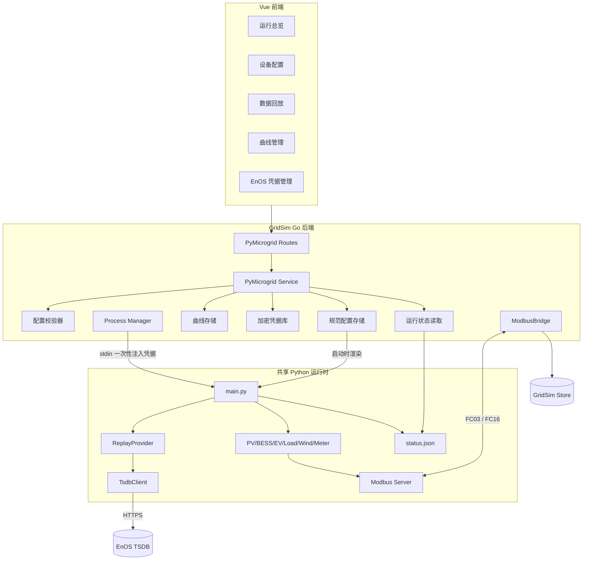

# GridSim TSDB 回放与风电模拟集成 Implementation Plan

**Goal:** 将 `microgridsimulate-0731` 中的 EnOS TSDB 多资产回放、Wind 模型和秒级 CSV 曲线能力集成到 GridSim 的 Python 微电网通道，并使全部业务参数都能通过 Web 界面配置、校验、保存和观察。

**Architecture:** 保留现有 `modbus_bridge` 数据通道，由 Go 管理实例配置、凭据、曲线、Python 子进程和运行状态，Python 负责设备物理模型与 TSDB 回放，Modbus TCP 负责运行值同步和控制下发。新增规范化 `PyMicrogridSpec` 作为唯一配置源，后端在启动前渲染兼容 Python 的 `device.json` 与 `replay_config.json`，避免前端同时维护多份相互重复的配置。

**Tech Stack:** Go 1.21+、Vue 3、TypeScript、Element Plus、ECharts、Python 3、requests、Modbus TCP、EnOS TSDB API。

---

## 1. 文档信息

| 项目 | 内容 |
|---|---|
| 目标项目 | `gridsim_dev` |
| 功能来源 | `microgridsimulate-0731/microgridsimulate` |
| 集成通道 | `modbus_bridge` / Python 微电网 |
| 设计状态 | 可实施 |
| 配置原则 | 全参数界面可配置、后端强校验、密钥不明文落盘 |
| 生效原则 | 停止实例后修改，下一次启动生效 |
| 兼容原则 | 保留旧 API 读取能力和旧 IOA；新界面只使用新规范 API |

## 2. 背景与现状

### 2.1 GridSim 当前调用过程

```mermaid
flowchart LR
    UI[PyMicrogridEditor] --> API[/api/v1/py-microgrid/{id}]
    API --> Handler[py_microgrid_handler.go]
    Handler --> Workspace[py_instances/{id}]
    Manager[manager.startBridge] --> Process[Python 子进程]
    Process --> ModbusServer[Python Modbus Server]
    Bridge[Go ModbusBridge] -->|FC03 轮询| ModbusServer
    Bridge --> Store[GridSim Store]
    UI -->|Dashboard/Points| Store
    UI -->|控制| Bridge
    Bridge -->|FC16| ModbusServer
```

现有实现已经具备：

- Python 子进程启动、停止和多实例 Modbus 端口隔离。
- `device.json` 配置读写。
- PV、BESS、EV、Load、Meter 配置界面。
- 曲线文件上传。
- Modbus 轮询、Store 同步、AO 控制和点表导出。
- Python 微电网拓扑、Dashboard 和测点页面。

### 2.2 最新 Python 代码带来的新增能力

1. EnOS token 获取与 TSDB 历史数据查询。
2. 多资产、多测点订阅和定时拉取。
3. 固定滞后回放、缓存去重、最近值保持。
4. Load 的 EnOS 数据源模式。
5. Wind 的 CSV、单资产 EnOS、聚合 EnOS 三种模式。
6. 风速、理论功率、实际功率和功率设点 Modbus 点位。
7. PV、Load、Wind 秒级 CSV 线性插值和循环播放。
8. Meter 汇总 Wind 实际发电功率。

### 2.3 禁止直接覆盖模板目录的原因

`microgridsimulate-0731` 不能原样复制到 `config/py_simulator`，因为已确认存在以下问题：

- EnOS access key 和 secret key 明文保存在 JSON 文件中。
- PV 和 EV 使用重复的空 `DeviceKey`，后加载设备会覆盖前一个设备。
- Wind 的「无设点」会被回写为 0，第二个更新周期变成停机。
- CSV 使用最后一个时间戳取模，最后样本不可达，60 秒采样曲线每周期提前 60 秒回绕。
- `pv_curve.csv` 配置引用与实际文件不一致。
- `requests` 依赖没有声明。
- ReplayProvider 没有在主程序退出时停止。
- EnOS 订阅同时存在于设备配置和 `replay_config.json`，容易形成两个不一致的数据源。
- 当前实例工作目录只在首次创建时复制源码，模板升级后旧实例仍运行旧代码。

本设计把这些问题列为集成前置修正，不保留错误行为。

## 3. 设计目标与范围

### 3.1 功能目标

- 支持 Load 从 EnOS TSDB 回放功率。
- 支持 Wind CSV、EnOS 单资产和 EnOS 聚合模式。
- 支持全部 EnOS、回放、设备和曲线参数通过界面配置。
- 支持连接测试、配置预检、字段级错误提示和运行状态展示。
- 支持 Wind 功率控制和恢复不限功率。
- 支持 Wind 在拓扑、Dashboard、测点表和点表导出中展示。
- 保证多实例的配置、凭据引用、曲线、端口和运行状态相互隔离。
- 保留现有 PV、BESS、EV、Load、Meter 配置和控制能力。

### 3.2 非目标

- 不把 TSDB 回放逻辑并入 Go 原生 `internal/microgrid` 引擎。
- 不允许浏览器直接调用 EnOS。
- 不在运行中热修改设备结构、凭据或回放参数。
- 不把 EnOS secret 返回给前端。
- 不继续以任意 JSON 文本作为新界面的主配置方式。

## 4. 总体架构

### 4.1 目标架构



### 4.2 唯一配置源

每个实例只维护一份规范配置：

```text
config/py_instances/<instance-id>/spec.json
```

启动时由 Go 生成运行目录：

```text
config/py_instances/<instance-id>/
├── spec.json                     # 唯一业务配置
├── curves/                       # 按 file_id 保存曲线
│   └── <sha256>.csv
└── runtime/
    ├── config/device.json        # 自动生成，不允许前端直接修改
    ├── config/replay_config.json # 自动生成，不含明文凭据
    ├── status.json               # Python 原子更新的运行状态
    └── log/
```

Python 代码和可执行文件保留在共享模板/发布目录，不再复制到每个实例。这样升级 GridSim 后，所有实例自动使用同一版本运行时，而实例数据仍然隔离。

## 5. 规范化配置模型

### 5.1 顶层结构与唯一字段契约

`PyMicrogridSpec` 顶层固定为 `schema_version`、`bridge`、`simulation`、`logging`、`replay`、`allocations` 和 `devices`。旧 `InstanceConfig.ModbusBridgeConfig` 只作为 `schema_version=1` 的迁移输入；迁移完成后，新界面不再同时写两份 Bridge 配置。

```json
{
  "schema_version": 2,
  "bridge": {
    "bind_host": "127.0.0.1",
    "modbus_port": 5021,
    "poll_interval_ms": 1000,
    "start_timeout_ms": 15000,
    "stop_grace_ms": 5000
  },
  "simulation": {
    "start_time": "00:00",
    "timezone": "Asia/Shanghai",
    "update_interval_ms": 1000
  },
  "logging": {
    "state_level": "INFO",
    "message_level": "INFO",
    "traffic_level": "INFO",
    "max_size_mb": 10,
    "max_backups": 5
  },
  "replay": {
    "enabled": true,
    "credential_ref": "enos-prod-cn5",
    "fetch_interval_sec": 30,
    "lookback_sec": 300,
    "delay_sec": 10,
    "target_lag_sec": 60,
    "cache_retention_sec": 600,
    "request_timeout_sec": 30,
    "page_size": 10000,
    "failure_policy": "hold",
    "max_staleness_sec": 180,
    "additional_subscriptions": [
      {"asset_id": "asset-observer", "point_ids": ["POINT.A"], "required": false}
    ]
  },
  "allocations": {
    "Meter": {"next_base": 1100, "reserved_bases": [1000]},
    "PV": {"next_base": 2100, "reserved_bases": [2000]},
    "BESS": {"next_base": 3100, "reserved_bases": [3000]},
    "EV": {"next_base": 4100, "reserved_bases": [4000]},
    "Load": {"next_base": 5100, "reserved_bases": [5000]},
    "Wind": {"next_base": 6100, "reserved_bases": [6000]}
  },
  "devices": []
}
```

`allocations` 为服务端管理的只读字段，和 `devices` 一起原子写入 `spec.json`。创建设备时，后端在持有实例配置锁的同一事务中读取该类型 `next_base`、写入设备 `ioa_base`、把基址追加到 `reserved_bases`，再按 100 增加 `next_base`。删除设备只删除 `devices` 记录，不删除或回退 `reserved_bases`；同名 DeviceKey 重建也视为新设备，不能取回旧基址。客户端 PUT 携带该字段时，后端忽略客户端值并使用服务端当前分配状态；两个并发创建请求由 ETag 和实例锁保证只有一个版本提交。

加载或迁移时校验：设备 `ioa_base` 必须存在于本类型 `reserved_bases`，所有历史基址全局唯一，`next_base` 必须大于全部保留基址且满足 100 对齐。旧实例迁移按既有设备类型和顺序一次性生成该账本；账本不完整或重复时返回 `INVALID_ALLOCATION_LEDGER`，禁止启动。备份、导出和恢复必须保留 allocations，恢复时不得根据当前 devices 重新压缩分配。

`revision` 不由客户端写入。后端对规范化 JSON 计算 SHA-256，并通过 HTTP `ETag` 返回，用于防止多人同时编辑覆盖。

### 5.2 设备与数据源判别联合

`source` 只允许以下四种结构，禁止把 `asset_id` 与 `csv` 字段直接放在 `source` 根节点：

```json
{"kind":"synthetic"}
```

```json
{
  "kind":"csv",
  "csv": {
    "file_id":"sha256-id",
    "interpolation":"linear",
    "end_behavior":"loop",
    "period_sec":86400,
    "scale":1,
    "offset":0
  }
}
```

```json
{
  "kind":"enos",
  "enos": {
    "asset_id":"asset-id",
    "theory_power_point":"WNAC.TheoryActivePW",
    "wind_speed_point":"WNAC.WindSpeed",
    "wind_speed_fallback_asset_ids":[]
  }
}
```

```json
{
  "kind":"enos_aggregate",
  "enos": {
    "aggregate_asset_ids":["asset-1","asset-2"],
    "theory_power_point":"WNAC.TheoryActivePW",
    "wind_speed_point":"WNAC.WindSpeed",
    "min_coverage_ratio":1
  }
}
```

Wind 设备完整示例：

```json
{
  "id": "018f4a60-2a0c-7c45-9d11-0fc861dbd501",
  "type": "Wind",
  "device_key": "WT_01",
  "slave_id": 11,
  "ioa_base": 6000,
  "include_in_meter": true,
  "params": {"rated_power_kw": 6250},
  "source": {
    "kind": "enos",
    "enos": {
      "asset_id": "asset-id",
      "theory_power_point": "WNAC.TheoryActivePW",
      "wind_speed_point": "WNAC.WindSpeed",
      "wind_speed_fallback_asset_ids": []
    }
  }
}
```

`id` 是服务端生成的 UUIDv7 稳定设备身份，不映射到 Python 配置或点表。新设备的 PUT 项必须省略 `id` 和 `ioa_base`；已有设备必须回传 GET 得到的 `id`，允许修改 `device_key` 但不允许修改 `id` 或 `ioa_base`。迁移时使用实例 ID、设备类型、旧 DeviceKey、Slave ID 和原序号生成确定性 UUIDv5，保证重复迁移结果一致。

`include_in_meter` 仅适用于 Wind。其他五类设备总是按既定功率平衡规则参与计算。

建议 Go 契约：

```go
type PyMicrogridSpec struct {
    SchemaVersion int                         `json:"schema_version"`
    Bridge        PyBridgeSpec                `json:"bridge"`
    Simulation    PySimulationSpec            `json:"simulation"`
    Logging       PyLoggingSpec               `json:"logging"`
    Replay        PyReplaySpec                `json:"replay"`
    Allocations   map[string]IOAAllocation    `json:"allocations"`
    Devices       []PyDeviceSpec              `json:"devices"`
}

type PySourceSpec struct {
    Kind string        `json:"kind"`
    CSV  *CSVSource    `json:"csv,omitempty"`
    EnOS *EnOSSource   `json:"enos,omitempty"`
}

type PyDeviceBase struct {
    ID        string `json:"id,omitempty"`       // GET 必有；新增 PUT 省略
    Type      string `json:"type"`
    DeviceKey string `json:"device_key"`
    SlaveID   int    `json:"slave_id"`
    IOABase   int    `json:"ioa_base,omitempty"` // GET 必有；新增 PUT 省略
}
```

建议 TypeScript 契约：

```ts
export interface PyMicrogridSpec {
  schema_version: 2
  bridge: PyBridgeSpec
  simulation: PySimulationSpec
  logging: PyLoggingSpec
  replay: PyReplaySpec
  allocations: Record<DeviceType, IOAAllocation>
  devices: PyDeviceSpec[]
}

export type PySourceSpec =
  | { kind: 'synthetic' }
  | { kind: 'csv'; csv: CSVSourceSpec }
  | { kind: 'enos'; enos: EnOSSourceSpec }
  | { kind: 'enos_aggregate'; enos: EnOSAggregateSourceSpec }

export interface PyDeviceBase {
  id?: string       // 新增草稿省略；GET/已保存设备必有
  device_key: string
  slave_id: number
  ioa_base?: number // 新增草稿省略；GET/已保存设备必有
}
```

后端负责把规范字段转换为 Python 兼容字段，例如：

| 规范字段 | Python 字段 |
|---|---|
| `device_key` | `DeviceKey` |
| `params.rated_power_kw` | `ratedPower` |
| `params.rated_capacity_kwh` | `ratedCapacity` |
| `params.soc_max_pct` | `socMax / 100` |
| `source.kind=csv` | `mode=0` |
| `source.kind=synthetic` | `mode=1` |
| PV/BESS/EV/Meter/Load `source.kind=enos` | `mode=2` |
| Wind `source.kind=enos` | `mode=2` |
| Wind `source.kind=enos_aggregate` | `mode=3` |
| `source.csv.file_id` | 运行目录中的安全 CSV 文件名 |
| `source.enos.asset_id` | `replay_asset_id` |
| `source.enos.aggregate_asset_ids` | `aggregate_assets` |

渲染后的 Python JSON 仍使用旧 `Devices:[{"Wind":[...]}]` 结构，但该结构只存在于运行目录，不作为新 API 契约。

## 6. 全参数配置清单

### 6.1 实例、仿真与日志参数

| 界面名称 | API 字段 | 默认值 | 校验 | 生效位置 |
|---|---|---:|---|---|
| Modbus 监听地址 | `bridge.bind_host` | `127.0.0.1` | 默认只允许本机；外部地址需管理员确认 | Go/Python |
| Modbus 端口 | `bridge.modbus_port` | 5021 | 1024～65535，全局端口唯一 | Go/Python |
| Go 轮询周期 | `bridge.poll_interval_ms` | 1000 | 200～10000 ms | Go Bridge |
| 启动超时 | `bridge.start_timeout_ms` | 15000 | 1000～120000 ms | Go Process |
| 停止宽限期 | `bridge.stop_grace_ms` | 5000 | 1000～30000 ms | Go Process |
| 仿真起始时间 | `simulation.start_time` | `00:00` | 严格 `HH:mm` | Python 模型 |
| 时区 | `simulation.timezone` | `Asia/Shanghai` | IANA 时区白名单 | TSDB/曲线 |
| Python 更新周期 | `simulation.update_interval_ms` | 1000 | 100～10000 ms | Python 主循环 |
| 状态日志级别 | `logging.state_level` | `INFO` | `DEBUG/INFO/WARNING/ERROR` | Python 日志 |
| 消息日志级别 | `logging.message_level` | `INFO` | 同上 | Python 日志 |
| Modbus 流量日志级别 | `logging.traffic_level` | `INFO` | 同上 | Python 日志 |
| 单文件上限 | `logging.max_size_mb` | 10 | 1～1024 MB | Python 日志 |
| 备份数量 | `logging.max_backups` | 5 | 0～100 | Python 日志 |

日志目录和 `simulation.log`、`message.log`、`modbus_traffic.log` 文件名固定在实例 `runtime/log`，不允许客户端配置路径，防止路径穿越。旧 `logging_config.json` 中的 `log_dir`、`log_file`、`message_log_file`、`traffic_log_file` 迁移为固定安全路径，其余字段映射到 `spec.logging`。

Go 轮询周期和 Python 更新周期是两个不同参数，界面分别说明，禁止合并为一个字段。

### 6.2 EnOS 凭据参数

凭据作为管理员管理的全局配置档案，实例只选择 `credential_ref`。

| 界面名称 | 字段 | 必填 | 展示规则 |
|---|---|---|---|
| 配置名称 | `name` | 是 | 实例选择时显示 |
| API 网关 | `apigw_address` | 是 | 只允许 HTTPS 域名白名单 |
| Access Key | `access_key` | 是 | 写入后不再返回 |
| Secret Key | `secret_key` | 是 | 密码框，写入后不再返回 |
| Organization ID | `org_id` | 是 | 可返回和展示 |

GET 响应只返回：

```json
{
  "id": "enos-prod-cn5",
  "name": "生产环境 CN5",
  "apigw_address": "ag-cn5.example.com",
  "org_id": "org-id",
  "access_key_present": true,
  "secret_key_present": true,
  "updated_at": "2026-07-31T09:00:00Z"
}
```

### 6.3 TSDB 回放参数

| 界面名称 | API 字段 | 默认值 | 校验与说明 |
|---|---|---:|---|
| 启用回放 | `replay.enabled` | false | 有 EnOS 设备时必须启用 |
| 凭据档案 | `replay.credential_ref` | — | 启用时必填 |
| 拉取间隔 | `replay.fetch_interval_sec` | 30 | 5～3600 秒 |
| 查询回溯时长 | `replay.lookback_sec` | 300 | 10～86400 秒 |
| 查询窗口延迟 | `replay.delay_sec` | 10 | 0～86400 秒 |
| 目标回放滞后 | `replay.target_lag_sec` | 60 | 0～86400 秒 |
| 缓存保留时长 | `replay.cache_retention_sec` | 600 | 不小于 `max(lookback, target_lag + 2×fetch_interval)` |
| HTTP 请求超时 | `replay.request_timeout_sec` | 30 | 1～120 秒 |
| 单页数据量 | `replay.page_size` | 10000 | 1～10000，必须实现翻页 |
| 数据失效阈值 | `replay.max_staleness_sec` | 180 | 不小于 `replay.fetch_interval_sec` |
| 失效策略 | `replay.failure_policy` | `hold` | `hold`、`zero`、`stop` |
| 附加订阅 | `replay.additional_subscriptions[]` | 空 | `{asset_id, point_ids[], required}`，默认 `required=false` |

联合校验：

```text
delay_sec <= target_lag_sec <= delay_sec + lookback_sec
```

设备中配置的 EnOS 资产和测点自动生成 `resolved_subscriptions`。界面展示生成结果但不要求重复录入 `replay.assets[]`。

#### 6.3.1 resolved subscription 生成矩阵

| 来源 | 测点 | `required` | 失效判定 |
|---|---|---:|---|
| PV `source.kind=enos` | `source.enos.power_point` | true | 单测点超过 `replay.max_staleness_sec` 即执行主策略 |
| BESS `source.kind=enos` | `source.enos.power_point` | true | 功率测点超过阈值即执行主策略 |
| BESS `source.kind=enos` | `source.enos.soc_point` | false | SOC 测点可选，失效时保持最后 SOC 值 |
| EV `source.kind=enos` | `source.enos.power_point` | true | 单测点超过阈值即执行主策略 |
| Meter `source.kind=enos` | `source.enos.power_point` | true | 单测点超过阈值即执行主策略 |
| Load `source.kind=enos` | `source.enos.power_point` | true | 单测点超过 `replay.max_staleness_sec` 即执行主策略 |
| Wind 单资产 | `source.enos.theory_power_point` | true | 理论功率超过阈值即执行主策略 |
| Wind 单资产 | `source.enos.wind_speed_point` | false | 只将风速标记 stale，理论功率继续运行 |
| Wind 单资产风速回退资产 | `source.enos.wind_speed_point` | false | 所有风速源都失效时风速按 hold/zero 展示，不触发 stop |
| Wind 聚合每个资产 | `source.enos.theory_power_point` | true，group=`wind_theory:<device-id>` | 以有效资产数/配置资产数计算覆盖率，低于 `source.enos.min_coverage_ratio` 执行主策略 |
| Wind 聚合每个资产 | `source.enos.wind_speed_point` | false，group=`wind_speed:<device-id>` | 只影响平均风速和风速新鲜度 |
| `replay.additional_subscriptions[]` | `point_ids[]` | 使用配置值，默认 false | 仅显式 `required=true` 才执行主策略 |

同一 `{asset_id, point_id}` 被多个设备引用时只拉取一次，但保留全部 consumer 和最严格 required/group 元数据。恢复条件为触发失效的 required 单点重新取得新数据，或 required group 覆盖率恢复到阈值并完成一次成功更新；恢复时清除该原因的 degraded 状态。

### 6.4 Meter 参数

| 参数 | API 字段 | 校验 |
|---|---|---|
| 设备标识 | `device_key` | 全实例唯一，1～64 字符 |
| Slave ID | `slave_id` | 1～247，全实例唯一 |
| IOA 基址 | `ioa_base` | 默认 1000，只读且持久化 |
| 数据源 | `source.kind` | `calculated`、`enos` |
| EnOS 资产 ID | `source.enos.asset_id` | — | EnOS 模式必填 |
| 功率测点 | `source.enos.power_point` | `METER.ActivePW` | EnOS 模式必填 |

每个实例固定一台 Meter。`source.kind=calculated` 时并网功率约定：

```text
METER.ActivePW = Load + EV + BESS - PV - Wind
```

`source.kind=enos` 时直接使用 EnOS 回放数据，不参与功率平衡计算。

BESS 正值表示充电，负值表示放电；Meter 正值表示购电，负值表示上网。

### 6.5 PV 参数

| 参数 | API 字段 | 默认值 | 校验 |
|---|---|---:|---|
| 设备标识 | `device_key` | 自动生成 | 唯一、非空 |
| Slave ID | `slave_id` | 自动分配 | 唯一，1～247 |
| IOA 基址 | `ioa_base` | 2000 + N×100 | 只读 |
| 额定功率 | `params.rated_power_kw` | 100 | 大于 0 kW |
| 数据源 | `source.kind` | `synthetic` | `csv`、`synthetic`、`enos` |
| CSV 文件 | `source.csv.file_id` | — | `source.kind=csv` 时必填 |
| EnOS 资产 ID | `source.enos.asset_id` | — | EnOS 模式必填 |
| 功率测点 | `source.enos.power_point` | `INV.GenActivePW` | EnOS 模式必填 |
| 插值方式 | `source.csv.interpolation` | `linear` | `linear` 或 `hold` |
| 结束行为 | `source.csv.end_behavior` | `loop` | `loop`、`hold`、`stop` |
| 周期 | `source.csv.period_sec` | 自动推导 | 必须大于最后时间戳 |
| 倍率 | `source.csv.scale` | 1 | 有限数 |
| 偏移 | `source.csv.offset` | 0 | 有限数 |

PV 控制动作统一为：`unlimited`、`stop`、`set(value)`。前端不直接操作底层哨兵值。

### 6.6 BESS 参数

| 参数 | API 字段 | 默认值 | 校验 |
|---|---|---:|---|
| 设备标识 | `device_key` | 自动生成 | 唯一、非空 |
| Slave ID | `slave_id` | 自动分配 | 唯一，1～247 |
| IOA 基址 | `ioa_base` | 3000 + N×100 | 只读 |
| 额定容量 | `params.rated_capacity_kwh` | 200 | 大于 0 |
| 最大充电功率 | `params.max_charge_power_kw` | 100 | 大于等于 0 |
| 最大放电功率 | `params.max_discharge_power_kw` | 100 | 大于等于 0 |
| SOC 下限 | `params.soc_min_pct` | 10 | 0～100% |
| 初始 SOC | `params.initial_soc_pct` | 50 | 位于上下限之间 |
| SOC 上限 | `params.soc_max_pct` | 90 | 0～100%，大于下限 |
| 标称电压 | `params.voltage_nominal_v` | 48 | 大于 0 |
| 内阻 | `params.resistance_ohm` | 0.01 | 大于等于 0 |
| 数据源 | `source.kind` | `synthetic` | `csv`、`synthetic`、`enos` |
| CSV 文件 | `source.csv.file_id` | — | CSV 模式必填 |
| EnOS 资产 ID | `source.enos.asset_id` | — | EnOS 模式必填 |
| 功率测点 | `source.enos.power_point` | `BS.ActivePW` | EnOS 模式必填 |
| SOC 测点 | `source.enos.soc_point` | `BS.SOC` | EnOS 模式可选 |

界面统一使用百分比，渲染 Python 配置时转换为 0～1。旧配置中 `socMax=100` 转换为 100%，禁止再解释为 10000%。

### 6.7 EV 参数

| 参数 | API 字段 | 默认值 | 校验 |
|---|---|---:|---|
| 设备标识 | `device_key` | 自动生成 | 唯一、非空 |
| Slave ID | `slave_id` | 自动分配 | 唯一，1～247 |
| IOA 基址 | `ioa_base` | 4000 + N×100 | 只读 |
| 额定功率 | `params.rated_power_kw` | 22 | 大于 0 |
| 最小充电功率 | `params.min_charge_power_kw` | 0 | 0～额定功率 |
| 充电系数 | `params.charge_factor` | 1 | 0～1，未显式控制时乘以额定功率 |
| 充电器类型 | `params.charger_type` | `AC` | `AC` 或 `DC` |
| 功率因数 | `params.power_factor` | 0.95 | 大于 0 且不超过 1 |
| 相模式 | `params.phase_mode` | 3 | AC 为 1 或 3；DC 固定 1 |
| 电压 | `params.voltage_v` | AC 220 / DC 400 | AC 200～250；DC 300～500 |
| 充电时段 | `params.charge_schedule[]` | 08:00～10:00 | 时间格式正确，允许跨零点，重叠时提示 |
| 数据源 | `source.kind` | `synthetic` | `csv`、`synthetic`、`enos` |
| CSV 文件 | `source.csv.file_id` | — | CSV 模式必填 |
| EnOS 资产 ID | `source.enos.asset_id` | — | EnOS 模式必填 |
| 功率测点 | `source.enos.power_point` | `PUB_CONN.ChargePW` | EnOS 模式必填 |

模型必须停止把 AO 命令寄存器作为计算结果回写，避免功率控制在下一周期自行切换为电流控制。

### 6.8 Load 参数

| 参数 | API 字段 | 默认值 | 校验 |
|---|---|---:|---|
| 设备标识 | `device_key` | 自动生成 | 唯一、非空 |
| Slave ID | `slave_id` | 自动分配 | 唯一，1～247 |
| IOA 基址 | `ioa_base` | 5000 + N×100 | 只读 |
| 基础功率 | `params.base_power_kw` | 120 | 大于等于 0 |
| 数据源 | `source.kind` | `csv` | `csv`、`synthetic`、`enos` |
| CSV 参数 | `source.csv.*` | — | CSV 模式显示 |
| EnOS 资产 ID | `source.enos.asset_id` | — | EnOS 模式必填 |
| 功率测点 | `source.enos.power_point` | `LD.ActivePW` | EnOS 模式必填 |

禁止在 EnOS 配置不完整时静默降级到随机模式。启动预检必须返回明确错误。

### 6.9 Wind 参数

| 参数 | API 字段 | Python 字段 | 默认值 | 校验 |
|---|---|---|---:|---|
| 设备标识 | `device_key` | `DeviceKey` | 自动生成 | 唯一、非空 |
| Slave ID | `slave_id` | `slave_id` | 自动分配 | 唯一，1～247 |
| IOA 基址 | `ioa_base` | — | 6000 + N×100 | 只读 |
| 是否计入电表 | `include_in_meter` | 新增 | true | 聚合展示设备可设 false |
| 额定功率 | `params.rated_power_kw` | `ratedPower` | — | 大于 0 |
| 数据源 | `source.kind` | `mode` | `csv` | `csv`、`enos`、`enos_aggregate` |
| CSV 文件 | `source.csv.file_id` | `csv_file` | — | CSV 模式必填，三列格式 |
| EnOS 资产 ID | `source.enos.asset_id` | `replay_asset_id` | — | 单资产模式必填 |
| 理论功率测点 | `source.enos.theory_power_point` | `replay_point_theory` | `WNAC.TheoryActivePW` | 非空 |
| 风速测点 | `source.enos.wind_speed_point` | `replay_point_wind_speed` | `WNAC.WindSpeed` | 可为空，但需显示无风速提示 |
| 聚合资产 | `source.enos.aggregate_asset_ids[]` | `aggregate_assets` | 空 | 聚合模式至少 1 个、去重 |
| 风速回退资产 | `source.enos.wind_speed_fallback_asset_ids[]` | `wind_speed_aggregate_assets` | 空 | 去重，不可包含空值 |
| 最低覆盖率 | `source.enos.min_coverage_ratio` | 新增 | 1.0 | 0～1 |

Wind 控制动作：

| 动作 | API | 底层值 | 行为 |
|---|---|---:|---|
| 跟随理论功率 | `unlimited` | -1 | 实际功率等于理论功率 |
| 停机 | `stop` | 0 | 实际功率为 0 |
| 限功率 | `set` | 大于 0 | `min(设点, 理论功率, 额定功率)` |

底层哨兵值只存在于 Go/Python 之间，不在界面暴露。

### 6.10 全部 AO 控制矩阵

| 设备/点 | 允许动作 | 校验 | 原子行为 |
|---|---|---|---|
| PV `INV.LimitPower` | `unlimited`、`stop`、`set` | set 为 0～额定功率 | unlimited 写额定功率；stop 写 0；Python 必须接受 0 并立即停机 |
| Wind `WTUR.SetActivePW` | `unlimited`、`stop`、`set` | set 为 0～额定功率 | 分别编码为 -1、0、正值 |
| BESS `BS.SysAPSetPoint` | `set`、`stop` | `[-maxDischarge, maxCharge]` | stop 写 0；正值充电、负值放电 |
| EV `PUB_CONN.ChargePWSet` | `set`、`stop` | 0～额定功率 | 切换到功率模式时，同一后端事务把 `ChargeCurSetL1` 清零 |
| EV `PUB_CONN.ChargeCurSetL1` | `set`、`stop` | 0 或 `[I_min, I_max]`；`I_min=min_charge_power_kw*1000/(phase_count*voltage_v*power_factor)`，`I_max` 同额定功率公式 | 切换到电流模式时，同一后端事务把 `ChargePWSet` 清零 |

Topology 和 capabilities 必须返回每个控制点实际支持的 actions、min、max 和 unit。若任一底层 FC16 写失败，整个组合控制返回失败，前端不得显示已生效；对 EV 双寄存器切换失败时，后端应尝试恢复切换前两个命令值。

### 6.11 PV、BESS 与 EV 确定计算规则

PV：数据源先产生可用功率 `P_source`，统一钳制到 `[0, rated_power_kw]`。控制上限 `P_cap` 在 unlimited、stop、set 下分别为 `rated_power_kw`、0、set value，最终 `INV.GenActivePW = min(P_source, P_cap)`；`INV.LimitPower` 保留命令上限而不是实际功率。示例：`P_source=80`、set=50 时实际 50 kW；unlimited 时 80 kW；stop 时 0 kW。

BESS：命令在更新周期之间保持，正值充电、负值放电。设周期为 `dt_sec`、容量为 `C_kwh`，先按功率上下限钳制命令，再按 SOC 剩余空间钳制：

```text
charge_room_kw = (soc_max_pct - soc_pct) / 100 * C_kwh * 3600 / dt_sec
discharge_room_kw = (soc_pct - soc_min_pct) / 100 * C_kwh * 3600 / dt_sec
P_actual = min(P_command, max_charge_power_kw, charge_room_kw)                 # command > 0
P_actual = max(P_command, -max_discharge_power_kw, -discharge_room_kw)        # command < 0
P_actual = 0                                                                   # command = 0
soc_next_pct = soc_pct + P_actual * dt_sec / 3600 / C_kwh * 100
```

到达上限后充电实际功率为 0，到达下限后放电实际功率为 0；`BS.ActivePW` 和 Meter 使用 `P_actual`，`BS.SysAPSetPoint` 保留命令值。充电累计量增加 `max(P_actual,0)*dt_sec/3600`，放电累计量增加 `max(-P_actual,0)*dt_sec/3600`，使用实际 `dt_sec` 而不是固定 1 秒。示例：200 kWh、SOC 50%、上限 90%、1 小时周期、充电命令 100 kW 时，实际只能充 80 kW，结束 SOC 为 90%。

EV：`charge_schedule` 是最高优先级运行许可，时段外所有实际功率、电流和状态反馈为 0，但 AO 命令保持以便进入时段后恢复。时段内若尚未下发控制，基准功率为 `rated_power_kw * charge_factor`；`charge_factor` 校验为 0～1。显式 stop 始终输出 0，不能被 `min_charge_power_kw` 抬高。功率模式只接受 0 或 `[min_charge_power_kw, rated_power_kw]`；电流模式按下式换算：

```text
phase_count = 3  # AC 三相
phase_count = 1  # AC 单相或 DC
P_from_current_kw = current_a * phase_count * voltage_v * power_factor / 1000
I_max_a = rated_power_kw * 1000 / (phase_count * voltage_v * power_factor)
P_actual = min(P_requested, rated_power_kw)
```

正的电流命令若换算功率低于最小充电功率则请求校验失败。`PUB_CONN.ChargePWSet` 和 `PUB_CONN.ChargeCurSetL1` 只保存命令；`PUB_CONN.ChargePW`、`CurrentL1/L2/L3` 是反馈，模型不得用反馈覆盖 AO。三相 AC 三相电流相等；单相 AC 和 DC 的 L2/L3 为 0。`ChargeEnergyKWH` 使用 `P_actual*dt_sec/3600` 累加。示例：三相 220 V、功率因数 0.95、电流命令 32 A 时请求功率为 20.064 kW；时段外或 stop 时实际值仍为 0。

对应单元测试必须固定上述三个 PV 向量、BESS SOC 上下限和 80 kW 边界向量、EV 20.064 kW/时段外/stop/最小功率向量。

## 7. CSV 曲线设计

### 7.1 文件格式

PV 和 Load：

```csv
seconds,power
0,0
60,10
120,20
```

Wind：

```csv
seconds,wind_speed,theory_power
0,6.2,1200
60,6.5,1350
120,6.7,1420
```

### 7.2 后端校验规则

- UTF-8 或 UTF-8 BOM。
- PV/Load 必须为 2 列，Wind 必须为 3 列。
- 时间为有限、非负、严格递增且不重复的秒数。
- 数值不得为 NaN 或 Infinity。
- 功率和风速默认不得为负。
- 默认上限 50 MB、200 万数据行，能力接口返回实际限制。
- 返回准确的错误行号和字段。
- 上传后计算 SHA-256，`file_id` 使用内容摘要，不使用客户端文件名作为磁盘路径。

### 7.3 正确循环周期

禁止使用：

```python
current_seconds % last_timestamp
```

采用：

```text
period = 显式 period_sec
或 period = 最后时间戳 + 推导出的采样间隔
position = elapsed_seconds % period
```

当位置位于最后样本之后、周期结束之前时，保持最后样本；到达周期边界后回到首样本。

### 7.4 曲线界面

- 上传前本地显示文件名和大小。
- 上传后调用服务端校验和预览。
- ECharts 显示时间轴、功率和风速。
- 显示行数、时长、采样间隔、最小值和最大值。
- 删除前检查所有实例引用；被引用文件禁止删除。
- 设备表单只选择 `file_id`，同时显示原始文件名。

## 8. 后端设计

### 8.1 Go 模块拆分

新增：

```text
internal/pymicrogrid/
├── model.go          # PyMicrogridSpec、设备联合类型、运行状态类型
├── validator.go      # 跨字段、跨设备、曲线引用校验
├── service.go        # 读取、保存、渲染、启动预检
├── renderer.go       # 生成 device.json 和 replay_config.json
├── migration.go      # 旧 device/replay 配置迁移
├── curve_store.go    # CSV 保存、校验、预览、引用检查
├── secret_store.go   # EnOS 凭据加密存储
├── runtime.go        # status.json 安全读取与状态归一化
├── model_test.go
├── validator_test.go
├── allocation_test.go
├── service_test.go
├── renderer_test.go
├── migration_test.go
├── curve_store_test.go
├── secret_store_test.go
└── runtime_test.go
```

现有文件职责调整：

| 文件 | 修改内容 |
|---|---|
| `cmd/gridsim/py_microgrid_handler.go` | 只保留路由、HTTP 解码和响应，调用 `pymicrogrid.Service` |
| `internal/model/instance.go` | 扩展 Bridge 监听地址、启动超时、停止宽限期 |
| `internal/manager/manager.go` | 使用共享运行时；启动前渲染配置并执行预检 |
| `pkg/protocol/modbus_bridge/process.go` | 支持 config/runtime 参数、stdin 凭据、优雅停止 |
| `pkg/protocol/modbus_bridge/bridge.go` | 串行化 Modbus 请求响应、严格校验响应、同步返回写错误 |
| `pkg/protocol/modbus_bridge/point_mapper.go` | 从统一 manifest 构建 Wind 和现有设备点表 |
| `pkg/openapi/spec.go` | 增加新 API 定义 |
| `pkg/errors/errors.go` | 支持字段错误数组和 request ID |

### 8.2 配置保存

保存过程：

1. 使用 `http.MaxBytesReader` 限制请求体。
2. `json.Decoder.DisallowUnknownFields()` 拒绝拼写错误字段。
3. 校验 `If-Match` 与当前 ETag。
4. 执行结构、范围、唯一性、引用和跨字段校验。
5. 规范化设备顺序和默认值。
6. 写入同目录临时文件。
7. `fsync` 后使用 `rename` 原子替换 `spec.json`。
8. 返回新 ETag 和 `requires_restart=true`。

运行中的实例执行 PUT 返回 `409 INSTANCE_RUNNING`，避免保存成功但运行时仍使用旧配置。

PUT 差异识别和分配规则：

1. 以不可变 `id` 匹配当前设备；相同 `id` 是更新或重命名，必须沿用原 `ioa_base`。
2. 省略 `id` 的项是新增，且必须同时省略 `ioa_base`；后端在实例锁内生成 UUIDv7 并从 allocations 分配基址。
3. 请求中缺少的当前 `id` 是删除；之后提交已删除或未知 `id` 返回 `UNKNOWN_DEVICE_ID`，不能借此取回旧 IOA。
4. 请求携带的 `id` 重复、类型变化或 `ioa_base` 与当前值不同，返回字段错误；类型变化必须删除后新建。
5. 新增项在规范化、全量校验或临时文件写入失败时，事务整体回滚，`next_base` 和 `reserved_bases` 不消耗；原子替换成功后即视为已分配，即使后续启动失败也不回收。
6. 并发 PUT 先检查 ETag，再持有实例锁重新检查；失败请求返回 412。客户端重新 GET 后重放新增意图，服务端只为最终成功事务分配一次。
7. PUT 成功响应必须返回完整规范 spec 和新 ETag，前端用响应中的 `id`、`ioa_base` 替换本地临时项。

### 8.3 配置校验

必须覆盖：

- `DeviceKey` 非空且全实例唯一。
- Slave ID 唯一且在 1～247。
- IOA 段不重叠且不因设备重排变化。
- 恰好一台 Meter。
- CSV 引用存在且类型匹配。
- EnOS 设备必须绑定有效凭据和资产测点。
- BESS SOC 范围与初始值关系正确。
- EV 电压、相模式、功率因数和功率范围正确。
- Wind 聚合资产去重，且不会自引用。
- `include_in_meter=false` 时在界面明确标记为观测/聚合设备。
- Replay 时间窗口联合约束正确。

统一错误响应：

```json
{
  "error": {
    "code": "VALIDATION_FAILED",
    "message": "配置校验未通过",
    "fields": [
      {
        "path": "devices[3].source.enos.asset_id",
        "code": "REQUIRED",
        "message": "EnOS 模式必须配置资产 ID"
      }
    ],
    "request_id": "req-20260731-0001"
  }
}
```

### 8.4 EnOS 凭据安全

- 新增全局凭据库，实例仅保存 `credential_ref`。
- 凭据使用 AES-256-GCM 加密后保存。
- 主密钥来自 `GRIDSIM_SECRET_KEY`，不得写入仓库、实例配置或日志。
- 开发模式未配置主密钥时，本地 CSV/随机模式仍可运行，EnOS 凭据功能显示为未启用；生产模式按 12.1 节拒绝服务启动。
- 凭据 API 仅管理员可写，GET 不返回 access key 和 secret key。
- 连接测试限制超时和调用频率，不跟随跨域重定向。
- 网关必须使用 HTTPS，并通过管理员网关白名单。
- Go 启动 Python 后，通过 stdin 一次性发送解密后的凭据；Python 读取后关闭 stdin。
- 命令行、环境变量、`device.json`、`replay_config.json`、`status.json` 和日志均不得出现明文凭据。
- 0731 代码中的已有凭据应在集成前轮换。

### 8.5 API 设计

#### 8.5.1 能力查询

```http
GET /api/v1/py-microgrid/capabilities
```

返回支持的 schema 版本、设备类型、数据源类型、曲线上限、状态枚举和点表 manifest hash。前端根据能力渲染，避免重复维护常量。

#### 8.5.2 规范配置

```http
GET /api/v1/py-microgrid/{id}/spec
PUT /api/v1/py-microgrid/{id}/spec
POST /api/v1/py-microgrid/{id}/validate
```

GET 返回 ETag。PUT 必须携带：

```http
If-Match: "<etag>"
```

缺少 `If-Match` 返回 428；版本不一致返回 412。

#### 8.5.3 运行状态

```http
GET /api/v1/py-microgrid/{id}/runtime
```

响应：

```json
{
  "overall_state": "degraded",
  "process": {
    "pid": 1234,
    "started_at": "2026-07-31T09:00:00Z",
    "last_tick_at": "2026-07-31T09:10:00Z",
    "runtime_version": "2.0.0",
    "config_revision": "sha256:...",
    "last_error": ""
  },
  "modbus": {
    "connected": true,
    "last_poll_at": "2026-07-31T09:10:00Z",
    "last_error": ""
  },
  "replay": {
    "state": "degraded",
    "last_request_at": "2026-07-31T09:09:30Z",
    "last_success_at": "2026-07-31T09:09:30Z",
    "consecutive_failures": 0,
    "target_lag_sec": 60,
    "caches": [
      {
        "asset_id": "asset-id",
        "point_id": "WNAC.WindSpeed",
        "count": 80,
        "earliest_at": "2026-07-31T09:04:00Z",
        "latest_at": "2026-07-31T09:09:20Z",
        "age_sec": 40,
        "cursor_lag_sec": 60,
        "clamped": false
      }
    ]
  }
}
```

状态枚举统一为：

```text
starting | running | degraded | stopping | stopped | error
```

Replay 关闭时额外使用 `disabled`。

#### 8.5.4 符号化控制

```http
POST /api/v1/py-microgrid/{id}/control
Content-Type: application/json
```

```json
{
  "device_key": "WT_01",
  "point": "WTUR.SetActivePW",
  "action": "set",
  "value": 1200
}
```

`action` 支持：`set`、`stop`、`unlimited`。响应返回请求值、底层值、有效值和控制模式。旧 `{ioa,value}` 请求保留一个兼容版本，但新界面不再使用。

#### 8.5.5 曲线

```http
GET    /api/v1/py-microgrid/{id}/curves
POST   /api/v1/py-microgrid/{id}/curves
GET    /api/v1/py-microgrid/{id}/curves/{file_id}/preview
DELETE /api/v1/py-microgrid/{id}/curves/{file_id}
```

#### 8.5.6 凭据

```http
GET    /api/v1/secrets/enos
POST   /api/v1/secrets/enos
PUT    /api/v1/secrets/enos/{credential_id}
DELETE /api/v1/secrets/enos/{credential_id}
POST   /api/v1/secrets/enos/{credential_id}/test
```

### 8.6 Python 运行时修改

新增：

```text
config/py_simulator/src/datasource/__init__.py
config/py_simulator/src/datasource/tsdb_client.py
config/py_simulator/src/datasource/replay_provider.py
config/py_simulator/src/datasource/runtime_status.py
config/py_simulator/src/models/wind_model.py
config/py_simulator/config/modbus_registers.json
config/py_simulator/requirements.lock
```

修改：

```text
config/py_simulator/main.py
config/py_simulator/src/models/load_model.py
config/py_simulator/src/models/pv_model.py
config/py_simulator/src/models/meter_model.py
config/py_simulator/src/models/ev_model.py
config/py_simulator/src/communication/modbus_server.py
config/py_simulator/py-microgrid-sim.spec
```

#### ReplayProvider 修正规则

- 每个 `(asset_id, point_id)` 单独维护时间范围、游标和新鲜度。
- 不使用所有测点共用的最早/最晚时间决定单点游标。
- 目标时间早于该测点第一条数据时返回空值，不读取未来点。
- 按资产实际测点列表查询，禁止资产与全量测点做笛卡尔组合。
- 完整处理分页，直到没有下一页。
- `localtime` 按 `simulation.timezone` 解析，内部统一 UTC epoch ms。
- 401 只刷新一次 token；429、5xx 和网络错误执行有上限退避。
- stop 使用 `threading.Event` 中断等待。
- 每次状态变化原子写入 `status.json`。
- 达到 `replay.max_staleness_sec` 后执行明确策略：
  - 只对 `resolved_subscriptions.required=true` 的测点判断实例失效；附加订阅默认不影响设备运行。
  - `hold`：保持最后值，设备和实例标记 degraded；恢复数据并连续成功一次后清除 degraded。
  - `zero`：对应设备输入置 0，立即重算设备实际功率和 Meter，状态保持 degraded；数据恢复后使用新值。
  - `stop`：设置 shutdown 原因并按有序退出流程停止 Python，实例最终状态为 error。
- Wind 聚合分别计算理论功率覆盖率和风速覆盖率。理论功率覆盖率低于 `source.enos.min_coverage_ratio` 时执行 `replay.failure_policy`；仅风速不足时保持或置零风速，不停止仍完整的理论功率回放。
- stdin 凭据协议固定为单行、最大 64 KB 的 UTF-8 JSON。父进程写完立即关闭管道；Python 在启动线程和网络请求前读取，构造客户端后清除原始字节引用。

#### Wind 修正规则

- AO 命令值不得作为模型计算结果写回命令寄存器。
- 初始控制值使用 -1，禁止使用 `None`。
- `-1` 跟随理论功率、`0` 停机、正值限功率。
- 聚合结果包含 `hits`、`expected` 和 `coverage`。
- 覆盖率不足时状态变为 degraded，并执行配置的失效策略。
- Meter 只汇总 `include_in_meter=true` 的 Wind。

#### 时间积分修正规则

PV 累计发电量、BESS SOC/累计电量、EV 累计电量使用 `time.monotonic()` 的实际时间差，不再假定每次更新固定为 1 秒。

### 8.7 统一 Modbus 点表

将寄存器定义移到 `config/modbus_registers.json`，Go、Python、拓扑 API 和点表导出读取同一文件。启动时比较 manifest hash，防止 Go/Python 点表版本不一致。

Wind：

| 点名 | 寄存器偏移 | IOA 偏移 | 类型 | 可写 | 单位 |
|---|---:|---:|---|---|---|
| `WNAC.WindSpeed` | 0 | 0 | AI | 否 | m/s |
| `WNAC.TheoryActivePW` | 2 | 1 | AI | 否 | kW |
| `WGEN.GenActivePW` | 4 | 2 | AI | 否 | kW |
| `WTUR.SetActivePW` | 6 | 3 | AO | 是 | kW |

其他必须统一的点：

- Meter 使用 `METER.ActivePW`，迁移时兼容旧 `ActivePower`。
- `PUB_CONN.PhaseMode` 使用整数语义的 AI，保留值 1 或 3，不能压缩为布尔值。
- `PUB_CONN.Voltage` 使用 offset 22、AI、只读；如以后需要电压控制，新增独立 AO。
- Python FC16 只允许 manifest 中声明为 writable 的 AO。
- 奇数地址、跨点写、AI/DI 写和未定义地址写返回标准 Modbus 异常。
- 异常响应必须为「原功能码 OR 0x80 + 独立异常码」。

### 8.8 ModbusBridge 并发与错误处理

现有轮询和控制共享一条 TCP 连接，必须增加事务级 `ioMu`：

```text
加锁 → 发送完整请求 → 读取完整响应 → 校验 → 解锁
```

必须校验 transaction ID、protocol ID、unit ID、MBAP length、功能码、byte count 和 FC16 回显地址/数量。只有收到合法 ACK 后才更新控制计数和 Store；失败时控制 API 返回错误，不能先显示为已生效。

### 8.9 进程生命周期与跨平台退出

Python 新增参数：

```text
--port
--bind-host
--config-dir
--runtime-dir
--status-file
--update-interval-ms
```

Python 内部只使用一个 `shutdown_event`：signal handler 只设置 Event；主更新循环和 Replay 等待使用 `shutdown_event.wait(timeout)`；Modbus accept 循环由关闭监听 socket 唤醒。`finally` 固定依次停止 ReplayProvider、Modbus Server、状态写入器和日志 handler。

停止顺序：

1. Go 标记 `stopping` 并停止新控制请求。
2. 关闭 Bridge 轮询，等待正在进行的 Modbus 事务结束。
3. POSIX 向子进程发送 SIGINT。
4. Windows 使用 `CREATE_NEW_PROCESS_GROUP` 启动子进程并发送 `CTRL_BREAK_EVENT`；若运行账户不支持控制台事件，则使用仅本机、按实例随机命名且带 ACL 的控制管道发送 shutdown，不直接进入强杀。
5. Python 设置 `shutdown_event`，停止 ReplayProvider、关闭 Modbus socket、刷新状态和日志。
6. 在 `bridge.stop_grace_ms` 内等待退出。
7. 超时后只终止记录 PID 的对应进程树，不执行宽泛的 `pkill -f main.py`。
8. 重复 Stop 必须幂等，关闭 channel/Event 不得 panic。

生产包缺少对应平台和架构的 Python 可执行文件时明确启动失败。开发模式可显式开启 Python 源码 fallback，生产环境禁止静默 fallback。

## 9. 前端设计

### 9.1 页面信息架构

`PyMicrogridEditor.vue` 调整为五个 Tab：

1. 「运行总览」：拓扑、功率汇总、TSDB 状态和设备控制。
2. 「设备配置」：顶部 `PyGlobalSettingsForm` 编辑 `bridge.*`、`simulation.*`、`logging.*`，下方编辑 Meter、PV、BESS、EV、Load、Wind。
3. 「数据回放」：EnOS 凭据选择、回放参数、自动订阅预览和连接测试。
4. 「曲线管理」：上传、校验、预览、引用和删除。
5. 「测点数据」：实时点值、来源、新鲜度、控制状态。

运行中时设备配置、数据回放和曲线引用为只读，但运行总览和允许的控制操作保持可用。

`PyGlobalSettingsForm` 在进入「设备配置」时随整份 spec 一次加载，分为「Bridge」「仿真时钟」「日志」三个折叠区，字段逐一对应第 6.1 节的 `bridge.*`、`simulation.*` 和 `logging.*`。它与设备表单共享同一 dirty 状态、`/validate`、ETag 和 PUT，不另设局部保存；后端字段错误按完整 path 定位到对应折叠区。

### 9.2 组件拆分

现有 `PyConfigEditor.vue` 超过单一职责，拆分为：

```text
web/src/components/py-microgrid/
├── PySpecEditor.vue
├── PyGlobalSettingsForm.vue
├── PyDeviceListEditor.vue
├── PyMeterForm.vue
├── PyPVForm.vue
├── PyBESSForm.vue
├── PyEVForm.vue
├── PyLoadForm.vue
├── PyWindForm.vue
├── PySourceSelector.vue
├── PyCSVSourceForm.vue
├── PyEnOSSourceForm.vue
├── PyReplaySettingsForm.vue
├── PyCredentialSelector.vue
├── PyResolvedSubscriptions.vue
├── PyCurveManager.vue
├── PyCurvePreview.vue
├── PyRuntimeStatusPanel.vue
└── PyControlDialog.vue
```

复用并扩展：

- `PyMicrogridTopologySvg.vue`
- `PyMicrogridDashboardCard.vue`
- `PyMicrogridDeviceCards.vue`

新增类型文件：

```text
web/src/types/pyMicrogrid.ts
```

禁止继续使用 `any` 保存设备配置。设备使用 TypeScript 判别联合：

```ts
type PyDeviceSpec =
  | MeterDeviceSpec
  | PVDeviceSpec
  | BESSDeviceSpec
  | EVDeviceSpec
  | LoadDeviceSpec
  | WindDeviceSpec
```

### 9.3 设备表单交互

公共字段固定在卡片顶部：设备标识、Slave ID、IOA 基址、是否计入电表。IOA 基址只读。

条件显隐：

- PV：选择「本地曲线」后显示 CSV 参数；选择「模拟曲线」后隐藏 CSV。
- Load：支持「本地曲线」「随机波动」「EnOS 回放」。
- Wind：支持「本地曲线」「EnOS 单资产」「EnOS 聚合」。
- Wind 单资产显示资产 ID、理论功率测点、风速测点和风速回退资产。
- Wind 聚合显示资产 ID 多值输入、两个测点、最低覆盖率。
- BESS 的 SOC 控件显示百分比，提交值仍为百分比规范字段。
- EV 切换 AC/DC 时自动修正允许的相模式和电压范围，并在修正前提示。

添加设备时，前端只生成唯一 `device_key` 建议值和未占用的 Slave ID；新设备的 `id` 与 `ioa_base` 保持空值并显示「保存后分配」。PUT 成功后以后端响应中的 UUIDv7 `id` 和 IOA 为准。IOA 只由服务端分配，前端不得推算或提交新基址。

删除或重排设备不回收旧 IOA；重命名 `device_key` 因稳定 `id` 不变而保留原 IOA，删除后再创建同名设备会得到新 `id` 和新 IOA，防止外部点表地址漂移。

### 9.4 EnOS 数据回放页面

页面分四块：

1. 凭据档案：所有有权使用该档案的用户可选择并测试；管理员额外看到「管理凭据」抽屉，可新增、编辑、删除。
2. 拉取参数：间隔、回溯、延迟、目标滞后、缓存、超时、分页。
3. 故障策略：数据失效阈值和 hold/zero/stop。
4. 解析后的订阅：按资产分组显示测点、引用设备、required/group 和是否完整。

凭据管理交互：新增时四个 EnOS 字段均按第 6.2 节校验；编辑时 access key 和 secret key 留空表示保留，输入新值表示轮换该字段；删除前显示引用实例。后端返回 `409 CREDENTIAL_IN_USE` 时抽屉保留并列出引用实例 ID，不从下拉列表移除。非管理员隐藏新增、编辑、删除入口，直接调用写接口收到 403 时显示「无权限管理凭据」，不能退化为前端本地保存。

保存前显示关系提示：

```text
查询窗口：当前时间 - 10 秒，向前查询 300 秒
回放位置：当前时间 - 60 秒
预计缓存：至少 600 秒
```

凭据测试只返回认证、权限、延迟和错误码，不展示 token 或原始响应。

### 9.5 Wind 运行展示

Dashboard 新增：

- Wind 总实际功率。
- Wind 总理论功率。
- 平均风速。
- 正常/降级设备数。

单设备卡片显示：

- 实际功率。
- 理论功率。
- 风速。
- 数据源模式。
- 回放数据时间和新鲜度。
- 控制模式：不限功率、停机、限功率。
- 聚合覆盖率。

拓扑图为 Wind 使用独立颜色和图形。设备数超过 8 时按类型分组，可横向滚动；聚合设备显示「聚合」标记。`include_in_meter=false` 的设备使用虚线边框，避免误认为已计入并网功率。

### 9.6 保存与错误反馈

保存过程：

1. 前端执行同步校验。
2. 调用 `/validate` 获取后端字段错误。
3. 按 `path` 定位并展开对应设备卡片。
4. 用户确认后携带 ETag 调用 PUT `/spec`。
5. 返回新 ETag，清除未保存标记。
6. 提示「配置将在下次启动时生效」。

页面离开时如有未保存修改，弹出确认。收到 412 时提示配置已被其他会话修改，并提供重新加载，不自动覆盖。

### 9.7 运行状态展示

页面每 2 秒轮询 `/runtime`。第一阶段不引入 SSE，降低鉴权和断线恢复复杂度。

状态颜色：

| 状态 | 颜色 | 文案 |
|---|---|---|
| `running` | 绿色 | 运行中 |
| `degraded` | 橙色 | 运行中，数据降级 |
| `starting` / `stopping` | 蓝色 | 启动中 / 停止中 |
| `error` | 红色 | 运行异常 |
| `stopped` | 灰色 | 已停止 |

降级状态必须显示原因，例如「3/10 台聚合风机有数据」「负荷数据已保持 185 秒」「回放游标被钳制到最新点」。

### 9.8 前端 API 类型

`web/src/api/index.ts` 新增函数但不继续堆放大型接口定义，类型移至 `types/pyMicrogrid.ts`：

```ts
getPyMicrogridCapabilities()
getPyMicrogridSpec(instanceId)
validatePyMicrogridSpec(instanceId, spec)
savePyMicrogridSpec(instanceId, spec, etag)
getPyMicrogridRuntime(instanceId)
controlPyMicrogridDevice(instanceId, command)
listPyMicrogridCurves(instanceId)
uploadPyMicrogridCurve(instanceId, file, kind)
previewPyMicrogridCurve(instanceId, fileId)
deletePyMicrogridCurve(instanceId, fileId)
listEnOSCredentials()
saveEnOSCredential(input)
deleteEnOSCredential(id)
testEnOSCredential(id)
```

## 10. Dashboard 与拓扑响应

### 10.1 Dashboard 扩展

保留现有字段并新增 Wind：

```json
{
  "status": "running",
  "grid_power_kw": -1800,
  "total_pv_kw": 100,
  "total_wind_kw": 5000,
  "total_wind_theory_kw": 5400,
  "average_wind_speed_ms": 7.2,
  "total_bat_kw": 200,
  "total_load_kw": 3000,
  "total_charger_kw": 100,
  "battery_soc": 52.4,
  "wind": [
    {
      "id": "WT_01",
      "name": "WT_01",
      "power_kw": 5000,
      "theory_power_kw": 5400,
      "wind_speed_ms": 7.2,
      "requested_setpoint_kw": 5000,
      "effective_setpoint_kw": 5000,
      "control_mode": "limited",
      "source_mode": "enos",
      "coverage": 1,
      "data_age_sec": 42
    }
  ]
}
```

多 BESS 的兼容字段 `battery_soc` 定义为按额定容量加权平均，每台设备仍返回自身 `soc_pct`。示例严格使用 `3000 + 100 + 200 - 100 - 5000 = -1800 kW`。Dashboard、Meter 模型和验收测试共同读取 `testdata/py_microgrid/power-balance.json`，避免三处复制不同数值。

### 10.2 Topology 扩展

设备响应不再要求前端硬编码控制 IOA 偏移：

```json
{
  "id": "WT_01",
  "type": "Wind",
  "name": "WT_01",
  "slave_id": 11,
  "ioa_base": 6000,
  "source_mode": "enos",
  "include_in_meter": true,
  "points": [
    {
      "name": "WGEN.GenActivePW",
      "ioa": 6002,
      "register_offset": 4,
      "point_type": "AI",
      "writable": false,
      "unit": "kW"
    }
  ],
  "controls": [
    {
      "name": "WTUR.SetActivePW",
      "ioa": 6003,
      "unit": "kW",
      "min": 0,
      "max": 6250,
      "actions": ["set", "stop", "unlimited"]
    }
  ]
}
```

## 11. 兼容与迁移

### 11.1 旧配置迁移

首次访问 `/spec` 或启动旧实例时执行一次迁移，来源优先级固定为：

1. `config/py_instances/<id>/config/`。
2. 实例目录不存在时，把共享 `config/py_simulator/config/` 复制为该实例的只读迁移快照，再从快照迁移。
3. 禁止在共享模板目录原地修改或写入实例配置。

迁移步骤：

1. 合并所有同类型 group，不能只读取第一组。
2. 空 `DeviceKey` 按类型和源文件顺序生成稳定名称，例如 `PV_01`、`EV_01`；随后按第 5.2 节规则为每台旧设备生成确定性 UUIDv5 `id`。
3. 重复 DeviceKey 或 Slave ID 无法安全修复时拒绝启动并返回字段报告。
4. 保留既有 Slave ID。
5. 按设备类型和原顺序固化 IOA：Meter 1000、PV 2000、BESS 3000、EV 4000、Load 5000、Wind 6000，每台增加 100；同时写入 `allocations.reserved_bases` 和 `next_base`。
6. SOC 转换使用确定规则：`socMax<=1` 且 `socMin<=1` 时三项按比例乘 100；`socMax>1` 时上下限按百分比，`initial_soc<=1` 时仍按比例乘 100。转换后校验 `0<=min<=initial<=max<=100`，迁移报告记录原值、转换结果和规则名称。
7. `csv_file` 存在时导入 CurveStore 并改写为 `source.csv.file_id`；文件不存在时返回 `MISSING_CURVE`，禁止静默切换为随机或正弦模式。
8. 读取旧 `replay_config.json`，把资产测点绑定并入对应设备 source；没有 replay 文件时设置 `replay.enabled=false`。
9. 旧 `enos_config.json` 不自动复制到 spec 或新运行目录。迁移报告标记 `CREDENTIAL_IMPORT_REQUIRED`；管理员导入并轮换凭据后选择 `credential_ref`，完成前 EnOS 实例禁止启动。
10. 生成 `spec.json` 和结构化迁移报告，不覆盖原文件。

迁移必须幂等，重复运行得到相同规范配置、IOA、曲线 file_id 和报告结论。

### 11.2 CSV 时间单位迁移

旧 GridSim CSV 第一列是小时，0731 CSV 第一列是秒。系统不根据文件名猜测单位：

- 明确选择「小时曲线转换」时，将小时乘以 3600。
- 明确选择「秒曲线导入」时保持原值。
- 自动检测只用于提示，不自动保存。
- 首列必须全部为有限非负数并严格递增，否则拒绝导入。
- 转换后重新执行列数、周期、NaN/Inf、大小和行数校验。
- 缺失曲线保持迁移阻断状态，不能创建空曲线代替。

### 11.3 API 兼容

- 旧 `GET /config` 保留，返回渲染后的兼容 `device.json`。
- 旧 `PUT /config` 在兼容期内转换为新规范并返回 `Deprecation`、`Sunset` 响应头。
- 新前端只调用 `/spec`。
- 旧 `{ioa,value}` 控制保留，但新前端使用符号化控制。
- 现有 PV/BESS/EV/Load/Meter IOA 不变；Wind 从 6000 开始。

## 12. 安全设计

### 12.1 凭据加密与生命周期

- 所有配置写入、凭据和连接测试接口必须经过认证，凭据写接口要求管理员角色。
- `GRIDSIM_SECRET_KEY` 固定为 base64 编码的 32 字节主密钥。生产模式缺失、解码失败或长度不符时，凭据功能拒绝启动。
- 使用 AES-256-GCM。密文库顶层和单条记录格式固定为：

```json
{
  "schema_version": 1,
  "active_key_id": "key-2026-08",
  "credentials": {
    "enos-prod-cn5": {
      "name": "生产环境 CN5",
      "apigw_address": "ag-cn5.example.com",
      "org_id": "org-id",
      "secret": {
        "version": 1,
        "alg": "A256GCM",
        "key_id": "key-2026-08",
        "nonce": "EjRWeJCrze8BI0Vn",
        "ciphertext": "7fE2e2yGfL8S8pGCL0M4T-UMiQH6hSz_B2R3kW9zYx0"
      }
    }
  }
}
```

- `nonce` 是 12 个随机字节的无填充 base64url；每次加密和轮换都重新生成，禁止同 key 重用。`ciphertext` 是无填充 base64url，内容为 Go `AEAD.Seal` 返回的「密文字节 + 16 字节 GCM tag」，不另设 tag 字段。
- 明文是只包含 `access_key`、`secret_key` 的 UTF-8 规范 JSON；AAD 固定为 UTF-8 字符串 `gridsim:enos-credential:v1:<credential-id>:<key-id>`。解密时 alg、版本、key ID 或 AAD 不匹配均拒绝。
- 凭据库在 Unix 使用 0600；Windows 设置为仅当前服务账户可读 ACL。创建、保存和轮换时先为同目录临时文件设置对应权限并验证，再 fsync 和原子 rename；替换后再次验证目标权限，失败则保留旧文件并报警。
- 轮换时同时提供旧、新 key ID：服务在内存中逐条解密并用新密钥重加密，全部成功后原子替换密文库；任一记录失败则文件和内存均保持原状态。
- 删除凭据前检查所有实例引用，存在引用时返回 `409 CREDENTIAL_IN_USE`。
- 后端不记录请求体中的 access key、secret key 或 token；GET 不返回这些字段的值或掩码。
- 状态文件、日志尾部和错误信息在返回前执行脱敏。

### 12.2 JWT 与权限

- JWT 密钥来自 `GRIDSIM_JWT_SECRET`，格式同主密钥：base64 编码的至少 32 个随机字节。生产模式缺失、解码失败或不足 32 字节时拒绝启动，不允许继续使用源码默认值。
- 仅接受 HS256。签发和校验固定 `iss="gridsim"`、`aud="gridsim-web"`，强制要求 `exp`，token 最长有效期 8 小时；`iat`/`nbf`/`exp` 允许的时钟偏差为 30 秒，超过即拒绝。
- 管理员角色以服务端用户记录为准，不能只信任 token 中可伪造的 role claim。
- 升级到新 JWT 密钥后旧 token 失效，用户需重新登录。
- 普通用户可以选择被授权的 `credential_ref`，不能读取或修改凭据内容。

### 12.3 网络、文件和发布

- TSDB 客户端启用 TLS 证书校验，不允许 HTTP，不跟随到白名单外域名的重定向。
- 连接测试限频、限时，不返回原始 token 或完整上游响应。
- 文件上传使用随机临时名，禁止路径穿越、符号链接逃逸和任意扩展名。
- `status.json` 作为不可信输入，限制大小并严格解码。
- 生产发布包不包含 `enos_config.json`、运行日志、`.bak`、源码凭据或 `__pycache__`。
- 0731 代码中出现过的凭据必须在迁移前人工轮换；迁移器不得读取并自动导入旧 secret。

## 13. 测试方案与发布门禁

### 13.1 Python 单元测试

新增：

```text
config/py_simulator/test/test_tsdb_client.py
config/py_simulator/test/test_replay_provider.py
config/py_simulator/test/test_wind_model.py
config/py_simulator/test/test_load_model.py
config/py_simulator/test/test_pv_model.py
config/py_simulator/test/test_battery_model.py
config/py_simulator/test/test_curve_timeline.py
config/py_simulator/test/test_meter_model.py
config/py_simulator/test/test_modbus_server.py
config/py_simulator/test/test_ev_model.py
config/py_simulator/test/test_lifecycle.py
```

重点用例：

- 多资产异频数据、重复点、乱序点和翻页。
- 401、429、5xx、超时、恢复和 token 刷新。
- 每个测点独立游标，不读取未来点。
- Wind unlimited、stop、set 连续多个周期保持正确。
- 聚合覆盖率不足触发 degraded。
- Load required 功率失效执行主策略；Wind 理论功率失效执行主策略；仅风速失效不停止理论功率；附加订阅默认不影响实例；数据恢复后清除对应 degraded 原因。
- CSV 循环边界不提前回绕。
- ReplayProvider 可以在等待期间立即停止。
- AI/DI 和未知寄存器写入返回正确异常。
- EV 功率控制不会在下一周期变成电流控制。

执行：

```bash
python -m pytest config/py_simulator/test -q
```

预期：全部通过。

### 13.2 Go 单元与并发测试

新增：

```text
internal/pymicrogrid/model_test.go
internal/pymicrogrid/validator_test.go
internal/pymicrogrid/allocation_test.go
internal/pymicrogrid/migration_test.go
internal/pymicrogrid/curve_store_test.go
internal/pymicrogrid/secret_store_test.go
internal/pymicrogrid/runtime_test.go
pkg/middleware/auth_test.go
pkg/protocol/modbus_bridge/bridge_test.go
pkg/protocol/modbus_bridge/point_mapper_test.go
cmd/gridsim/py_microgrid_handler_test.go
```

`internal/pymicrogrid/allocation_test.go` 必须逐项覆盖：两个相同 ETag 并发新增只有一个提交；412 后重新 GET/重放只分配一次；DeviceKey 重命名保留 ID/IOA；删除后同名重建得到新 ID/IOA；校验或临时写失败不消耗基址；原子保存成功但启动失败仍保留基址；迁移账本稳定；备份恢复不压缩；未知/重复 ID 和篡改 IOA 被拒绝。

`internal/pymicrogrid/secret_store_test.go` 使用固定 golden vector 校验 nonce 12 字节、Seal 输出含 16 字节 tag、AAD 绑定凭据 ID/key ID、错误 key/AAD 拒绝、轮换全成或全败、Unix 0600 和 Windows ACL 保持。`pkg/middleware/auth_test.go` 覆盖短于 32 字节密钥、非 HS256、缺失/错误 `exp`/`iss`/`aud`、超过 8 小时有效期和 30 秒时钟偏差边界。

执行：

```bash
go test ./internal/pymicrogrid ./pkg/protocol/modbus_bridge ./cmd/gridsim
go test -race ./internal/pymicrogrid ./pkg/protocol/modbus_bridge
```

预期：全部通过且无 data race。

### 13.3 前端验证

重点覆盖：

- 六类设备所有字段的显示、编辑、条件显隐和往返保存。
- EnOS secret 不回显。
- ETag 冲突提示。
- 后端字段错误定位到具体设备和字段。
- Wind 拓扑、Dashboard、控制和降级状态。
- CSV 上传、预览和删除引用检查。
- 运行中配置只读。
- 1024 px 以下页面单列显示，表单不溢出。

执行：

```bash
cd web
npm run build
```

`build` 已包含 `vue-tsc --noEmit`。预期：类型检查和 Vite 构建均通过。

### 13.4 自动化 CI 与原生 Python 产物

新增或修改的精确路径：

```text
config/py_simulator/requirements-dev.lock
scripts/build-py-runtime.sh
scripts/build-py-runtime.ps1
scripts/test-py-microgrid-e2e.py
scripts/scan-release-secrets.py
scripts/smoke-package.sh
scripts/smoke-package.ps1
build.sh
.github/workflows/ci.yml
```

`requirements-dev.lock` 精确锁定 pytest 等测试依赖。测试使用本地 EnOS mock server，禁止依赖生产凭据或公网服务。`.github/workflows/ci.yml` 是修改现有文件，不重新创建。

迁移 fixture 逐文件固定为：

```text
testdata/migration/legacy-gridsim/py_instances/legacy-grid/config/device.json
testdata/migration/legacy-gridsim/py_instances/legacy-grid/config/pv_curve.csv
testdata/migration/legacy-gridsim/py_instances/legacy-grid/config/load_curve.csv
testdata/migration/legacy-gridsim/expected/legacy-grid/spec.json
testdata/migration/legacy-gridsim/expected/legacy-grid/migration-report.json

testdata/migration/legacy-0731/py_instances/legacy-0731/config/device.json
testdata/migration/legacy-0731/py_instances/legacy-0731/config/replay_config.json
testdata/migration/legacy-0731/py_instances/legacy-0731/config/enos_config.json
testdata/migration/legacy-0731/py_instances/legacy-0731/config/data/wind_curve.csv
testdata/migration/legacy-0731/expected/legacy-0731/spec.json
testdata/migration/legacy-0731/expected/legacy-0731/migration-report.json

testdata/migration/legacy-0731/py_instances/legacy-0731-missing-curve/config/device.json
testdata/migration/legacy-0731/expected/legacy-0731-missing-curve/migration-report.json
```

fixture 中的 `enos_config.json` 只使用 `__fixture_redacted__`，expected report 必须包含 `CREDENTIAL_IMPORT_REQUIRED`；missing-curve expected report 必须包含 `MISSING_CURVE`。golden 文件使用规范 JSON 排序，Go 测试逐字段比较，不只做快照文本比较。

CI 固定顺序：

```text
Python unit
→ Go unit
→ Linux go test -race
→ Frontend build
→ 原生 PyInstaller matrix
→ 同平台 package
→ package smoke
→ secret scan
```

原生构建矩阵固定为：

| platform | GitHub runner | Python runtime artifact | GridSim artifact |
|---|---|---|---|
| `linux-amd64` | `ubuntu-24.04` | `py-runtime-linux-amd64-${{ github.sha }}` | `gridsim-linux-amd64-${{ github.sha }}` |
| `linux-arm64` | `ubuntu-24.04-arm` | `py-runtime-linux-arm64-${{ github.sha }}` | `gridsim-linux-arm64-${{ github.sha }}` |
| `windows-amd64` | `windows-2022` | `py-runtime-windows-amd64-${{ github.sha }}` | `gridsim-windows-amd64-${{ github.sha }}` |

若 GitHub 组织未启用 `ubuntu-24.04-arm`，使用带标签 `[self-hosted, linux, arm64, gridsim-build]` 的原生 ARM64 runner；禁止在 amd64 runner 上用 PyInstaller 交叉生成 ARM64。每个 runtime 目录包含 `py-microgrid-sim` 或 `py-microgrid-sim.exe`、`manifest.json`；manifest 写入完整 commit SHA、platform、Python/PyInstaller 版本和依赖锁文件 SHA-256。package job 只接受 platform 和 commit SHA 完全匹配的 runtime。

`build.sh` 新增 `--platform`、`--py-runtime-dir` 参数，并在 `dist/VERSION` 写入实际 `DIST_VERSION`。workflow 把 `env.PLATFORM` 固定设置为 `${{ matrix.platform }}`。Linux matrix job 的完整命令为：

```bash
python -m pip install -r config/py_simulator/requirements-dev.lock
python -m pytest config/py_simulator/test -q
go test ./...
CGO_ENABLED=1 go test -race ./internal/pymicrogrid ./pkg/protocol/modbus_bridge
(cd web && npm ci && npm run build)
bash scripts/build-py-runtime.sh --platform "${PLATFORM}" --output "build/py-runtime/${PLATFORM}"
bash build.sh --skip-web --platform "${PLATFORM}" --py-runtime-dir "build/py-runtime/${PLATFORM}"
DIST_VERSION="$(cat dist/VERSION)"
bash scripts/smoke-package.sh "dist/gridsim-v${DIST_VERSION}-${PLATFORM}.tar.gz"
python scripts/test-py-microgrid-e2e.py --package "dist/gridsim-v${DIST_VERSION}-${PLATFORM}.tar.gz" --duration 120 --instances 2
python scripts/scan-release-secrets.py "dist/gridsim-v${DIST_VERSION}-${PLATFORM}.tar.gz"
```

其中 `PLATFORM` 只取 `linux-amd64` 或 `linux-arm64`。Windows matrix job 的完整命令为：

```powershell
python -m pip install -r config/py_simulator/requirements-dev.lock
python -m pytest config/py_simulator/test -q
go test ./...
Push-Location web; npm ci; npm run build; Pop-Location
powershell -ExecutionPolicy Bypass -File scripts/build-py-runtime.ps1 -Platform windows-amd64 -OutputDir build\py-runtime\windows-amd64
bash build.sh --skip-web --platform windows-amd64 --py-runtime-dir build/py-runtime/windows-amd64
$DistVersion = (Get-Content dist\VERSION -Raw).Trim()
$Package = "dist\gridsim-v$DistVersion-windows-amd64.zip"
powershell -ExecutionPolicy Bypass -File scripts/smoke-package.ps1 -Package $Package
python scripts/test-py-microgrid-e2e.py --package $Package --duration 120 --instances 2
python scripts/scan-release-secrets.py $Package
```

对应包内固定路径分别为 `config/py_simulator/bin/linux-amd64/py-microgrid-sim`、`config/py_simulator/bin/linux-arm64/py-microgrid-sim`、`config/py_simulator/bin/windows-amd64/py-microgrid-sim.exe`。生产包不复制 Python 源码 fallback。双实例 30 分钟稳定性测试作为 nightly 和 release gate；普通提交使用 120 秒双实例冒烟。

### 13.5 集成验收

1. 同机启动两个 Python 微电网实例，使用不同 Modbus 端口，连续运行 30 分钟，配置、曲线、状态和控制互不污染。
2. Load EnOS 回放值在 Store、Dashboard 和导出点表中一致。
3. 10 台 Wind 的实际功率、理论功率、风速和聚合覆盖率正确。
4. 首台 Wind IOA 为 6000～6003，第二台为 6100～6103。
5. `METER.ActivePW = Load + EV + BESS - PV - Wind`，误差不超过 0.01 kW。
6. Wind unlimited、stop、set 三种控制均收到合法 FC16 ACK，并持续多个更新周期。
7. 断开 EnOS 后按 max staleness 和 failure policy 进入预期状态；恢复后游标继续前进且不倒退。
8. 运行日志、配置、导出包、进程命令行和状态文件不包含 access key、secret key 或 token。
9. 旧实例迁移后既有 PV/BESS/EV/Load/Meter IOA 不变。
10. Linux 和 Windows 发布包均能在未安装 Python 的环境启动两个实例。

## 14. 分阶段实施计划

### Task 1：建立规范配置与校验器

**Files:**

- Create: `internal/pymicrogrid/model.go`
- Create: `internal/pymicrogrid/validator.go`
- Create: `internal/pymicrogrid/model_test.go`
- Create: `internal/pymicrogrid/validator_test.go`
- Modify: `internal/model/instance.go`

- [ ] 定义顶层 Spec、六类设备判别结构、Replay、CSV 和 EnOS source 类型。
- [ ] 编写唯一 DeviceKey、Slave ID、IOA、SOC、EV、Replay 联合校验的失败测试。
- [ ] 实现默认值规范化和字段路径错误。
- [ ] 运行 `go test ./internal/pymicrogrid`，预期通过。

### Task 2：实现配置存储、迁移和曲线管理

**Files:**

- Create: `internal/pymicrogrid/service.go`
- Create: `internal/pymicrogrid/renderer.go`
- Create: `internal/pymicrogrid/migration.go`
- Create: `internal/pymicrogrid/curve_store.go`
- Create: `internal/pymicrogrid/service_test.go`, `internal/pymicrogrid/renderer_test.go`, `internal/pymicrogrid/allocation_test.go`, `internal/pymicrogrid/migration_test.go`, `internal/pymicrogrid/curve_store_test.go`
- Modify: `internal/manager/manager.go`

- [ ] 先编写原子保存、ETag 冲突、空 DeviceKey、重复 group 和 SOC 转换测试。
- [ ] 实现 `spec.json` 原子保存和兼容配置渲染。
- [ ] 实现内容寻址的曲线上传、校验、预览和引用检查。
- [ ] 移除实例源码复制和共享目录 fallback，实例目录只保存数据。
- [ ] 运行相关 Go 测试，预期通过。

### Task 3：实现凭据安全和 TSDB 客户端

**Files:**

- Create: `internal/pymicrogrid/secret_store.go`
- Create: `internal/pymicrogrid/secret_store_test.go`
- Create: `config/py_simulator/src/datasource/tsdb_client.py`
- Create: `config/py_simulator/src/datasource/replay_provider.py`
- Create: `config/py_simulator/test/test_tsdb_client.py`
- Create: `config/py_simulator/test/test_replay_provider.py`
- Modify: `pkg/middleware/auth.go`
- Create: `pkg/middleware/auth_test.go`

- [ ] 编写密钥不落盘、错误主密钥和密钥轮换测试。
- [ ] 实现 AES-GCM 凭据库和管理员接口。
- [ ] 实现 stdin 凭据注入。
- [ ] 实现分页、独立游标、时区、退避和失效策略。
- [ ] 运行 Go 和 Python 测试，预期通过。

### Task 4：集成 Wind 和修正模型行为

**Files:**

- Create: `config/py_simulator/src/models/wind_model.py`
- Modify: `config/py_simulator/main.py`
- Modify: `config/py_simulator/src/models/load_model.py`
- Modify: `config/py_simulator/src/models/pv_model.py`
- Modify: `config/py_simulator/src/models/meter_model.py`
- Modify: `config/py_simulator/src/models/ev_model.py`
- Create: `config/py_simulator/test/test_wind_model.py`, `config/py_simulator/test/test_load_model.py`, `config/py_simulator/test/test_pv_model.py`, `config/py_simulator/test/test_meter_model.py`, `config/py_simulator/test/test_ev_model.py`, `config/py_simulator/test/test_battery_model.py`, `config/py_simulator/test/test_curve_timeline.py`
- Create: `testdata/py_microgrid/power-balance.json`

- [ ] 先复现并固定 Wind 第二周期归零、CSV 周期、EV AO 自反馈测试。
- [ ] 实现 Wind 三种 source 和符号化控制底层语义。
- [ ] 实现 Load EnOS 模式和严格缺配置错误。
- [ ] 修正 CSV 周期与实际 delta 积分。
- [ ] 修正 Meter Wind 汇总和 `include_in_meter`。
- [ ] 运行 Python 测试，预期通过。

### Task 5：统一点表和加强 ModbusBridge

**Files:**

- Create: `config/py_simulator/config/modbus_registers.json`
- Modify: `config/py_simulator/src/communication/modbus_server.py`
- Modify: `pkg/protocol/modbus_bridge/point_mapper.go`
- Modify: `pkg/protocol/modbus_bridge/bridge.go`
- Create: `pkg/protocol/modbus_bridge/bridge_test.go`
- Create: `pkg/protocol/modbus_bridge/point_mapper_test.go`

- [ ] 编写 manifest hash、Wind IOA、EV PhaseMode/Voltage 和写权限测试。
- [ ] Go/Python 均从 manifest 加载点位。
- [ ] 修正标准 Modbus 异常响应。
- [ ] 增加事务锁和完整响应校验。
- [ ] 运行 `go test -race ./pkg/protocol/modbus_bridge`，预期通过。

### Task 6：实现新 API 与运行状态

**Files:**

- Modify: `cmd/gridsim/py_microgrid_handler.go`
- Create: `internal/pymicrogrid/runtime.go`
- Create: `cmd/gridsim/py_microgrid_handler_test.go`
- Modify: `pkg/openapi/spec.go`
- Modify: `pkg/errors/errors.go`

- [ ] 编写 spec、validate、runtime、curve、credential 和 control API 测试。
- [ ] 使用精确路径段和方法分派替换 `HasPrefix`。
- [ ] 实现 ETag、请求体限制、严格 JSON 和字段错误。
- [ ] 扩展 Dashboard/Topology，不再由前端硬编码控制 IOA。
- [ ] 运行 Go API 测试，预期通过。

### Task 7：拆分并升级前端配置界面

**Files:**

- Modify: `web/src/views/PyMicrogridEditor.vue`
- Modify: `web/src/views/ConfigPage.vue`
- Modify: `web/src/api/index.ts`
- Create: `web/src/types/pyMicrogrid.ts`
- Create: `web/src/components/py-microgrid/PySpecEditor.vue`, `web/src/components/py-microgrid/PyGlobalSettingsForm.vue`, `web/src/components/py-microgrid/PyDeviceListEditor.vue`, `web/src/components/py-microgrid/PyMeterForm.vue`, `web/src/components/py-microgrid/PyPVForm.vue`, `web/src/components/py-microgrid/PyBESSForm.vue`, `web/src/components/py-microgrid/PyEVForm.vue`, `web/src/components/py-microgrid/PyLoadForm.vue`, `web/src/components/py-microgrid/PyWindForm.vue`, `web/src/components/py-microgrid/PySourceSelector.vue`, `web/src/components/py-microgrid/PyCSVSourceForm.vue`, `web/src/components/py-microgrid/PyEnOSSourceForm.vue`, `web/src/components/py-microgrid/PyReplaySettingsForm.vue`, `web/src/components/py-microgrid/PyCredentialSelector.vue`, `web/src/components/py-microgrid/PyResolvedSubscriptions.vue`, `web/src/components/py-microgrid/PyCurveManager.vue`, `web/src/components/py-microgrid/PyCurvePreview.vue`, `web/src/components/py-microgrid/PyRuntimeStatusPanel.vue`, `web/src/components/py-microgrid/PyControlDialog.vue`
- Modify: `web/src/components/py-microgrid/PyMicrogridTopologySvg.vue`, `web/src/components/py-microgrid/PyMicrogridDashboardCard.vue`, `web/src/components/py-microgrid/PyMicrogridDeviceCards.vue`

- [ ] 定义无 `any` 的判别联合类型和 API 类型。
- [ ] 实现五 Tab 页面和未保存状态。
- [ ] 实现六类设备全部字段及条件显隐。
- [ ] 实现凭据选择、管理员新增/编辑/删除、引用冲突、连接测试、回放参数和订阅预览。
- [ ] 实现曲线上传、ECharts 预览和引用提示。
- [ ] 实现 Wind Dashboard、拓扑、降级状态和符号化控制。
- [ ] 运行 `npm run build`，预期通过。

### Task 8：构建、迁移和文档更新

**Files:**

- Modify: `config/py_simulator/py-microgrid-sim.spec`
- Create: `config/py_simulator/requirements.lock`
- Create: `config/py_simulator/requirements-dev.lock`
- Modify: `build.sh`
- Modify: `docs/GridSim-Python微电网使用指南.md`
- Modify: `docs/PACKAGING.md`
- Create: `testdata/migration/legacy-gridsim/py_instances/legacy-grid/config/device.json`
- Create: `testdata/migration/legacy-gridsim/py_instances/legacy-grid/config/pv_curve.csv`
- Create: `testdata/migration/legacy-gridsim/py_instances/legacy-grid/config/load_curve.csv`
- Create: `testdata/migration/legacy-gridsim/expected/legacy-grid/spec.json`
- Create: `testdata/migration/legacy-gridsim/expected/legacy-grid/migration-report.json`
- Create: `testdata/migration/legacy-0731/py_instances/legacy-0731/config/device.json`
- Create: `testdata/migration/legacy-0731/py_instances/legacy-0731/config/replay_config.json`
- Create: `testdata/migration/legacy-0731/py_instances/legacy-0731/config/enos_config.json`
- Create: `testdata/migration/legacy-0731/py_instances/legacy-0731/config/data/wind_curve.csv`
- Create: `testdata/migration/legacy-0731/expected/legacy-0731/spec.json`
- Create: `testdata/migration/legacy-0731/expected/legacy-0731/migration-report.json`
- Create: `testdata/migration/legacy-0731/py_instances/legacy-0731-missing-curve/config/device.json`
- Create: `testdata/migration/legacy-0731/expected/legacy-0731-missing-curve/migration-report.json`
- Create: `scripts/test-py-microgrid-e2e.py`, `scripts/build-py-runtime.sh`, `scripts/build-py-runtime.ps1`, `scripts/smoke-package.sh`, `scripts/smoke-package.ps1`, `scripts/scan-release-secrets.py`
- Modify: `.github/workflows/ci.yml`

- [ ] 锁定 Python 直接依赖版本，`requests` 使用精确版本而非开放范围。
- [ ] 将 datasource、证书和 manifest 纳入 PyInstaller。
- [ ] 构建时校验二进制对应的源码 hash，过期时构建失败而不是静默跳过。
- [ ] 删除发布包中的密钥、日志、备份和缓存。
- [ ] 使用真实 0731 脱敏配置执行迁移测试。
- [ ] 执行 Python、Go、race、前端 build 和双实例验收。

## 15. 关键设计决策

| 决策 | 选择 | 原因 |
|---|---|---|
| 集成到哪套微电网 | Python `modbus_bridge` | 最新功能本身是 Python 模型和 Modbus 从站，避免重写到 Go 引擎 |
| 配置源 | `spec.json` | 消除 device/replay/前端三份配置不一致 |
| EnOS 订阅 | 从设备 source 自动生成 | 避免资产测点重复录入 |
| 凭据 | 全局加密档案 + 实例引用 | 可复用、可轮换、不会进入实例导出 |
| 凭据注入 | stdin 一次性注入 | 不出现在文件、命令行和环境变量 |
| 实例运行时 | 共享代码 + 实例数据目录 | 升级后旧实例不会继续使用旧源码 |
| 配置生效 | 停止后保存，下次启动生效 | 设备结构和订阅热更新风险高 |
| Wind 控制 | 符号化动作 | 前端不感知 -1/0 等哨兵值 |
| 点表 | JSON manifest 单一来源 | 防止 Go、Python、导出点表不一致 |
| 状态更新 | 2 秒 HTTP 轮询 | 复用现有鉴权和页面模式，第一阶段不增加 SSE 复杂度 |
| CSV 标识 | SHA-256 `file_id` | 防止路径问题并支持去重 |
| 兼容策略 | 旧读接口保留，新 UI 只用新接口 | 降低一次性迁移风险 |

## 16. 完成定义

同时满足以下条件才视为集成完成：

- 最新功能的所有有效参数均可从界面查看和配置。
- 前端、Go 规范配置、Python 渲染配置的字段和单位往返一致。
- EnOS 凭据不在仓库、配置、日志、状态、导出和进程参数中明文出现。
- Wind、Load EnOS 回放和秒级 CSV 在多实例环境稳定运行。
- 已修复 Wind 第二周期归零、CSV 周期、设备键重复、曲线缺失、EV AO 自反馈和资源清理问题。
- 新旧设备 IOA 兼容，Wind 点表、Dashboard、拓扑和控制完整。
- Python 测试、Go 测试、Go race、前端构建和双实例验收全部通过。
